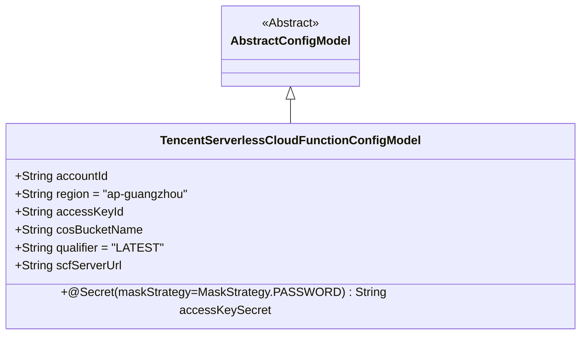
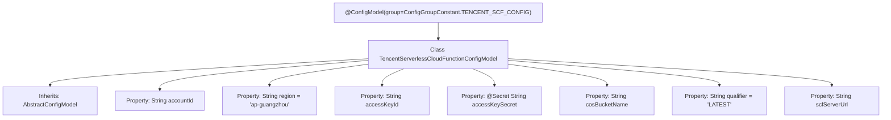

# Basic Information

|      |      |
|------|------|
| Name | TencentServerlessCloudFunctionConfigModel |
| Language | .java |
| Code Path | WeFe/common/java/common-wefe/src/main/java/com/welab/wefe/common/wefe/dto/global_config/calculation_engine/fc/TencentServerlessCloudFunctionConfigModel.java |
| Package Name | com.welab.wefe.common.wefe.dto.global_config.calculation_engine.fc |
| Dependencies | ['com.welab.wefe.common.fieldvalidate.secret.MaskStrategy', 'com.welab.wefe.common.fieldvalidate.secret.Secret', 'com.welab.wefe.common.wefe.dto.global_config.base.AbstractConfigModel', 'com.welab.wefe.common.wefe.dto.global_config.base.ConfigGroupConstant', 'com.welab.wefe.common.wefe.dto.global_config.base.ConfigModel'] |
| Brief Description | Tencent Cloud Function configuration class, containing fields such as account ID, region, secret key, COS bucket name, version number, and service address. |

# Description

The content defines a configuration model class named `TencentServerlessCloudFunctionConfigModel`, belonging to the `TENCENT_SCF_CONFIG` group. The class includes multiple configuration fields: account ID, default region as `ap-guangzhou`, `AccessKeyId`, `AccessKeySecret` with a password masking policy, COS bucket name, `qualifier` with a default version number of `LATEST`, and the URL of the SCF service address. All fields are public properties inherited from the base class `AbstractConfigModel`.

# Class Summary

| Name   | Type  | Description |
|-------|------|-------------|
| TencentServerlessCloudFunctionConfigModel | class | Tencent Cloud Function configuration class, containing fields such as account ID, region, secret key, COS bucket name, version number, and service address. |

## Class TencentServerlessCloudFunctionConfigModel

|      |      |
|------|------|
| Access Modifier | @ConfigModel(group = ConfigGroupConstant.TENCENT_SCF_CONFIG);public |
| Type | class |
| Name | TencentServerlessCloudFunctionConfigModel |
| Description | Tencent Cloud Function configuration class, containing fields such as account ID, region, secret key, COS bucket name, version number, and service address. |

### UML Class Diagram

This code describes a Tencent Cloud Serverless Function configuration model class that inherits from an abstract base configuration class. The class contains public fields such as account ID, region, access keys, COS bucket name, etc., with the accessKeySecret field annotated using a password masking strategy. The region and qualifier fields have default values, while the scfServerUrl field stores the service invocation address. This configuration model is marked as a Tencent Cloud SCF configuration group via the @ConfigModel annotation.

### Internal Method Call Graph

This flowchart illustrates the structure of the Tencent Cloud Function configuration class, annotating the class annotation, inheritance relationship, and 7 key configuration properties. It includes details such as default region values and secret masking annotations, fully presenting the data structure of the configuration model. All properties are related to Tencent Cloud Function invocation, including core parameters like account credentials and service URLs, achieving standardized management through inheritance from an abstract configuration model.

### Field List

| Name  | Type  | Description |
|-------|-------|------|
| accessKeySecret | String | Declare a key string variable `accessKeySecret` for password masking policy. |
| region = "ap-guangzhou" | String | Tencent Cloud Guangzhou Region API parameters, used to specify the service deployment location. |
| cosBucketName | String | Declare a public string variable cosBucketName to store the COS bucket name. |
| accessKeyId | String | Declare a public string variable accessKeyId. |
| accountId | String | Declare a public string variable accountId. |
| qualifier = "LATEST" | String | The string variable qualifier is initialized to "LATEST". |
| scfServerUrl | String | Declare a public string variable scfServerUrl. |

### Method List

| Name  | Type  | Description |
|-------|-------|------|

