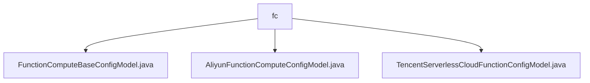

# Basic Information

|      |      |
|------|------|
| Name | fc |
| Language | .java |
| Code Path | WeFe/common/java/common-wefe/src/main/java/com/welab/wefe/common/wefe/dto/global_config/calculation_engine/fc |
| Package Name | docs.common.java.common-wefe.src.main.java.com.welab.wefe.common.wefe.dto.global_config.calculation_engine.fc |
| Brief Description | The `FunctionComputeBaseConfigModel` class inherits from `AbstractConfigModel` and includes provider, daily cost limit, and monthly cost limit. The `AliyunFunctionComputeConfigModel` class contains Alibaba Cloud configurations such as account, region, and secret key. The `TencentServerlessCloudFunctionConfigModel` class includes Tencent Cloud configurations such as account, region, and secret key. |

# Description

## Overview  
This module serves as the configuration management system for the Function Compute service, with its core responsibility being the unified management of serverless computing resources across multiple cloud platforms (Alibaba Cloud/Tencent Cloud). The interface specifications adhere to the constraints of the abstract base class AbstractConfigModel, utilizing the @Check annotation for parameter validation and supporting default value settings for mandatory fields. Key data structures include provider type, cost limits, account credentials, and region information. External dependencies are limited to Alibaba Cloud OSS and Tencent Cloud COS storage services. For example, Alibaba Cloud configurations require specifying a VPC network, while Tencent Cloud requires configuring an SCF service address.  

## Primary Business Scenarios  
The module supports the initialization configuration of multi-cloud Function Compute services, resembling a cloud resource management bus pattern. Typical workflows include setting basic cost thresholds, binding cloud account credentials, and associating object storage. For instance, Alibaba Cloud requires configuring a dedicated network, while Tencent Cloud necessitates specifying a COS bucket name. All configurations are standardized through an inheritance hierarchy and support automatic updates to the LATEST version. Integration use cases cover end-to-end management from account authentication to resource allocation.

### Package Internal Structure View

This flowchart illustrates the file structure of the computing engine configuration module in the WeFe project. The root node is the fc folder, which contains three subfiles: the base configuration model, Alibaba Cloud Function Compute configuration model, and Tencent Cloud Serverless Cloud Function configuration model. These files are located under the global configuration's computing engine directory and are used for configuring serverless computing functionalities of different cloud service providers.

# File List

| Name   | Type  | Description |
|-------|------|-------------|
| [FunctionComputeBaseConfigModel.java](FunctionComputeBaseConfigModel.md) | file | Basic configuration class for function computing, including mandatory settings such as provider (default: Alibaba Cloud), daily cost limit (default: 500), and monthly cost limit (default: 1000). |
| [AliyunFunctionComputeConfigModel.java](AliyunFunctionComputeConfigModel.md) | file | Alibaba Cloud Function Compute configuration class, including account type, ID, region, key, OSS bucket name, and optional VPC, switch, security group ID, and version number, with the default region set to cn-shenzhen. |
| [TencentServerlessCloudFunctionConfigModel.java](TencentServerlessCloudFunctionConfigModel.md) | file | Tencent Cloud Function configuration class, containing fields such as account ID, region, secret key, COS bucket name, version number, and service address. |

