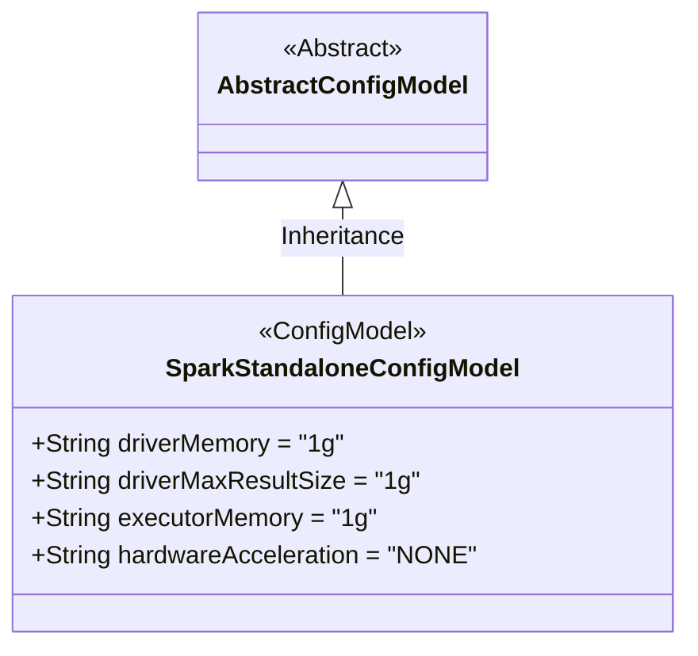
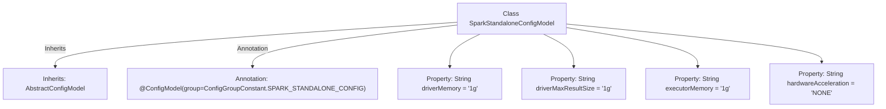

# Basic Information

|      |      |
|------|------|
| Name | SparkStandaloneConfigModel |
| Language | .java |
| Code Path | WeFe/common/java/common-wefe/src/main/java/com/welab/wefe/common/wefe/dto/global_config/calculation_engine/spark/SparkStandaloneConfigModel.java |
| Package Name | com.welab.wefe.common.wefe.dto.global_config.calculation_engine.spark |
| Dependencies | ['com.welab.wefe.common.wefe.dto.global_config.base.AbstractConfigModel', 'com.welab.wefe.common.wefe.dto.global_config.base.ConfigGroupConstant', 'com.welab.wefe.common.wefe.dto.global_config.base.ConfigModel'] |
| Brief Description | Spark standalone configuration class, including Driver memory, result set size, Executor memory, and hardware acceleration settings, all defaulting to 1g or NONE. |

# Description

SparkStandaloneConfigModel is a configuration model class belonging to the SPARK_STANDALONE_CONFIG group. It defines four key parameters: driverMemory sets the Driver memory with a default of 1g; driverMaxResultSize controls the maximum result set size with a default of 1g; executorMemory specifies the memory for each executor with a default of 1g; hardwareAcceleration indicates hardware acceleration options, supporting two enum values, NONE and GPU, with NONE as the default. All memory parameter units support m and g.

# Class Summary

| Name   | Type  | Description |
|-------|------|-------------|
| SparkStandaloneConfigModel | class | Spark standalone configuration class, including Driver memory, result set size, Executor memory, and hardware acceleration configuration items, with default values all set to 1g or NONE. |

## Class SparkStandaloneConfigModel

|      |      |
|------|------|
| Access Modifier | @ConfigModel(group = ConfigGroupConstant.SPARK_STANDALONE_CONFIG);public |
| Type | class |
| Name | SparkStandaloneConfigModel |
| Description | Spark standalone configuration class, including Driver memory, result set size, Executor memory, and hardware acceleration configuration items, with default values all set to 1g or NONE. |

### UML Class Diagram

This code demonstrates a Spark standalone deployment configuration model class that inherits from an abstract configuration base class. The SparkStandaloneConfigModel class contains four public string fields: driverMemory (driver memory), driverMaxResultSize (maximum result size), executorMemory (executor memory), and hardwareAcceleration (hardware acceleration type), all with default values. Marked with the @ConfigModel annotation as a Spark standalone configuration group, it is used for centralized management of Spark cluster resource parameter configurations.

### Internal Method Call Graph

This flowchart illustrates the structure of the SparkStandaloneConfigModel class, which inherits from AbstractConfigModel and carries the @ConfigModel annotation. The class contains four configuration properties: driverMemory (driver memory), driverMaxResultSize (maximum result size), executorMemory (executor memory), and hardwareAcceleration (hardware acceleration), all with default values. This configuration class defines key parameters for Spark standalone deployment mode, managed through enumerated values for memory units (m/g) and acceleration types (NONE/GPU).

### Field List

| Name  | Type  | Description |
|-------|-------|------|
| driverMemory = "1g" | String | The Java variable driverMemory is defined as the string "1g", indicating a driver memory size of 1GB. |
| driverMaxResultSize = "1g" | String | The parameter driverMaxResultSize is set to 1GB, limiting the maximum size of results returned by the driver. |
| executorMemory = "1g" | String | The code defines a string variable named executorMemory with the value "1g", indicating that the executor memory size is 1GB. |
| hardwareAcceleration = "NONE" | String | The variable hardwareAcceleration is set to "NONE", indicating that hardware acceleration is disabled. |

### Method List

| Name  | Type  | Description |
|-------|-------|------|

