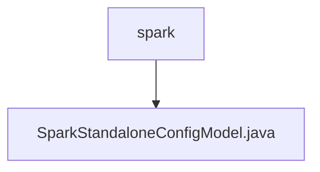

# Basic Information

|      |      |
|------|------|
| Name | spark |
| Language | .java |
| Code Path | WeFe/common/java/common-wefe/src/main/java/com/welab/wefe/common/wefe/dto/global_config/calculation_engine/spark |
| Package Name | docs.common.java.common-wefe.src.main.java.com.welab.wefe.common.wefe.dto.global_config.calculation_engine.spark |
| Brief Description | Spark standalone configuration class, including Driver memory, result set size, Executor memory, and hardware acceleration settings, all defaulting to 1g or NONE. |

# Description

SparkStandaloneConfigModel is a configuration model class belonging to the SPARK_STANDALONE_CONFIG group. It defines four key parameters: driverMemory sets the Driver memory with a default value of 1g; driverMaxResultSize controls the maximum result set size with a default of 1g; executorMemory specifies the memory for each executor with a default of 1g; hardwareAcceleration represents the hardware acceleration option, supporting two enum values: NONE and GPU, with NONE as the default. All memory parameters support units of m and g.

### Package Internal Structure View

This flowchart illustrates the hierarchical relationship of Spark computing engine configurations. The top-level node is the spark directory, which contains a specific configuration model file SparkStandaloneConfigModel.java. This structure reflects the organization of configuration files, where implementation classes for specific functionalities are placed in dedicated directories, adhering to the standard package structure design principles of Java projects.

# File List

| Name   | Type  | Description |
|-------|------|-------------|
| [SparkStandaloneConfigModel.java](SparkStandaloneConfigModel.md) | file | Spark standalone configuration class, including Driver memory, result set size, Executor memory, and hardware acceleration settings, all defaulting to 1g or NONE. |

