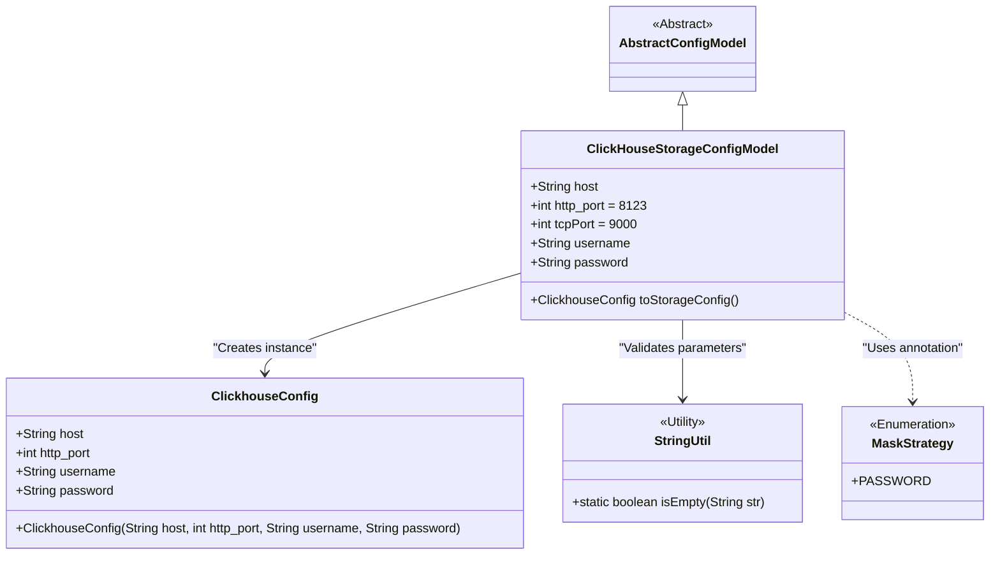
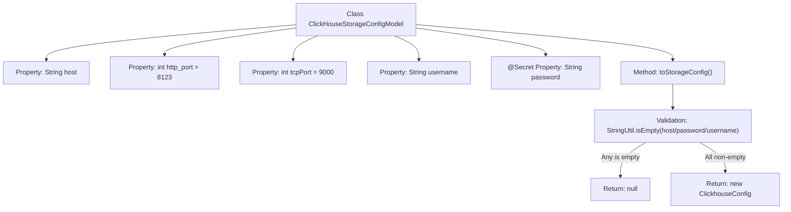

# Basic Information

|      |      |
|------|------|
| Name | ClickHouseStorageConfigModel |
| Language | .java |
| Code Path | WeFe/common/java/common-wefe/src/main/java/com/welab/wefe/common/wefe/dto/global_config/storage/ClickHouseStorageConfigModel.java |
| Package Name | com.welab.wefe.common.wefe.dto.global_config.storage |
| Dependencies | ['com.welab.wefe.common.wefe.dto.global_config.base.AbstractConfigModel', 'com.welab.wefe.common.wefe.dto.global_config.base.ConfigGroupConstant', 'com.welab.wefe.common.wefe.dto.global_config.base.ConfigModel', 'com.welab.wefe.common.fieldvalidate.secret.MaskStrategy', 'com.welab.wefe.common.fieldvalidate.secret.Secret', 'com.welab.wefe.common.util.StringUtil', 'com.welab.wefe.common.wefe.dto.storage.ClickhouseConfig'] |
| Brief Description | ClickHouse storage configuration class, containing fields for host, port, username, and password, providing a method to convert to ClickhouseConfig, returning null when key fields are missing. |

# Description

This is a ClickHouse storage configuration model class, belonging to the CLICKHOUSE_STORAGE configuration group. It inherits from an abstract configuration model class and includes fields for host address, HTTP port (default 8123), TCP port (default 9000), username, and password. The password field employs a password masking policy. The class provides a method to convert the configuration into a ClickhouseConfig object, with a check for empty required fields before conversion.

# Class Summary

| Name   | Type  | Description |
|-------|------|-------------|
| ClickHouseStorageConfigModel | class | The ClickHouse storage configuration class includes fields for host, HTTP/TCP ports, username, and password, providing a method to convert to ClickhouseConfig, with the password field being encrypted. |

## Class ClickHouseStorageConfigModel

|      |      |
|------|------|
| Access Modifier | @ConfigModel(group = ConfigGroupConstant.CLICKHOUSE_STORAGE);public |
| Type | class |
| Name | ClickHouseStorageConfigModel |
| Description | The ClickHouse storage configuration class includes fields for host, HTTP/TCP ports, username, and password, providing a method to convert to ClickhouseConfig, with the password field being encrypted. |

### UML Class Diagram

This class diagram illustrates the core structure of ClickHouse storage configuration. ClickHouseStorageConfigModel inherits from AbstractConfigModel, containing configuration items such as host, ports, and authentication information, and converts them into a ClickhouseConfig object via the toStorageConfig() method. The password field is desensitized using the @Secret annotation, with StringUtil employed for null checks. The design implements the conversion logic from configuration model to storage configuration while adhering to security best practices.

### Internal Method Call Graph

This flowchart illustrates the structure and core method logic of the ClickHouseStorageConfigModel class. The class contains 5 configuration properties, with the password field marked as sensitive via the @Secret annotation. The toStorageConfig() method first validates the non-emptiness of host/username/password - returning null if any is empty, and constructing a ClickhouseConfig object only when all are valid. The process clearly demonstrates the security validation logic during configuration conversion.

### Field List

| Name  | Type  | Description |
|-------|-------|------|
| host | String | Declare a public string variable host. |
| password | String | The code defines a password field, using the @Secret annotation with the masking strategy set to PASSWORD, indicating that this field requires confidential handling. |
| http_port = 8123 | int | The HTTP service port is set to 8123. |
| tcpPort = 9000 | int | Defined a public integer variable tcpPort with an initial value of 9000. |
| username | String | Public string variable username. |

### Method List

| Name  | Type  | Description |
|-------|-------|------|
| toStorageConfig | ClickhouseConfig | The method checks whether the host, password, and username are empty. If any of them is empty, it returns null; otherwise, it returns a ClickhouseConfig object containing these fields. |

