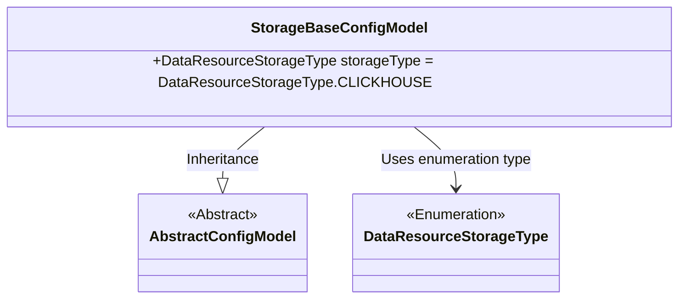
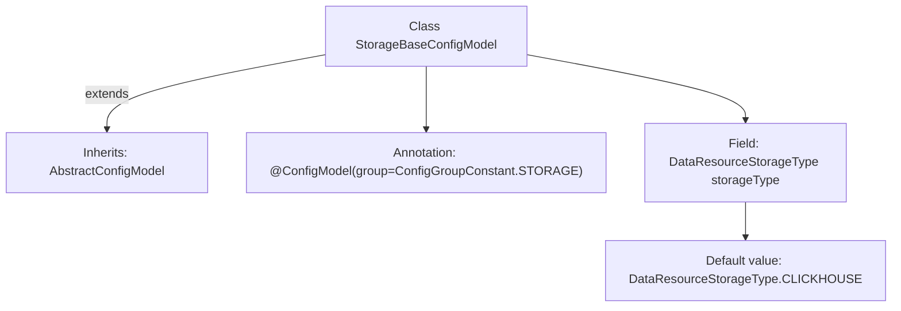

# Basic Information

|      |      |
|------|------|
| Name | StorageBaseConfigModel |
| Language | .java |
| Code Path | WeFe/common/java/common-wefe/src/main/java/com/welab/wefe/common/wefe/dto/global_config/storage/StorageBaseConfigModel.java |
| Package Name | com.welab.wefe.common.wefe.dto.global_config.storage |
| Dependencies | ['com.welab.wefe.common.wefe.dto.global_config.base.AbstractConfigModel', 'com.welab.wefe.common.wefe.dto.global_config.base.ConfigGroupConstant', 'com.welab.wefe.common.wefe.dto.global_config.base.ConfigModel', 'com.welab.wefe.common.wefe.enums.DataResourceStorageType'] |
| Brief Description | The storage configuration class StorageBaseConfigModel is annotated as a storage group configuration, with the default storage type set to CLICKHOUSE. |

# Description

The content describes a Java class named StorageBaseConfigModel, which extends AbstractConfigModel and is marked with the @ConfigModel annotation as part of the STORAGE configuration group. This class defines a public field named storageType, with a default value of CLICKHOUSE from the DataResourceStorageType enum. This configuration model is used to store basic configuration information related to storage.

# Class Summary

| Name   | Type  | Description |
|-------|------|-------------|
| StorageBaseConfigModel | class | The storage configuration class StorageBaseConfigModel inherits from AbstractConfigModel, with the default storage type being CLICKHOUSE, belonging to the STORAGE configuration group. |

## Class StorageBaseConfigModel

|      |      |
|------|------|
| Access Modifier | @ConfigModel(group = ConfigGroupConstant.STORAGE);public |
| Type | class |
| Name | StorageBaseConfigModel |
| Description | The storage configuration class StorageBaseConfigModel inherits from AbstractConfigModel, with the default storage type being CLICKHOUSE, belonging to the STORAGE configuration group. |

### UML Class Diagram

This class diagram illustrates that StorageBaseConfigModel inherits from the abstract class AbstractConfigModel and contains a storageType field of the DataResourceStorageType enumeration. StorageBaseConfigModel is marked as a storage configuration group via the @ConfigModel annotation, with CLICKHOUSE set as the default storage type. The design ensures extensibility of the configuration model, allowing switching between different storage backend types by modifying the enumeration values.

### Internal Method Call Graph

This code defines a configuration model class named StorageBaseConfigModel, which inherits from the base class AbstractConfigModel. The class is annotated with @ConfigModel specifying the configuration group as STORAGE, and internally declares a storageType field with a default value of CLICKHOUSE enum type. This structure represents a storage-related base configuration model, where configuration grouping is managed through annotations. The field's default value indicates that the system uses ClickHouse as the default storage engine.

### Field List

| Name  | Type  | Description |
|-------|-------|------|
| storageType = DataResourceStorageType.CLICKHOUSE | DataResourceStorageType | The storage type is set to CLICKHOUSE. |

### Method List

| Name  | Type  | Description |
|-------|-------|------|

