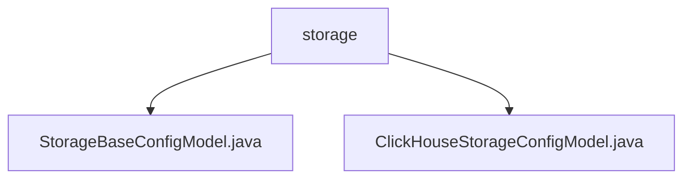

# Basic Information

|      |      |
|------|------|
| Name | storage |
| Language | .java |
| Code Path | WeFe/common/java/common-wefe/src/main/java/com/welab/wefe/common/wefe/dto/global_config/storage |
| Package Name | docs.common.java.common-wefe.src.main.java.com.welab.wefe.common.wefe.dto.global_config.storage |
| Brief Description | StorageBaseConfigModel is a Java class for the STORAGE configuration group that inherits from AbstractConfigModel, containing a default CLICKHOUSE storageType field. ClickHouseStorageConfigModel is its subclass, belonging to the CLICKHOUSE_STORAGE group, which includes fields such as host, port, username, and password. It provides a method to convert to ClickhouseConfig and validates required fields. |

# Description

## Overview  
The core responsibility of this module is to provide storage-related configuration management functionalities, including basic storage type definitions and ClickHouse-specific configurations. The interface specification adheres to the abstract configuration model system, grouped and identified using the @ConfigModel annotation. Key data structures consist of the basic type fields in StorageBaseConfigModel and connection parameters (e.g., host/port/credentials) in ClickHouseStorageConfigModel. External dependencies only involve the DataResourceStorageType enumeration. For example, the CLICKHOUSE type default value implements the basic abstraction of storage types.  

## Key Business Scenarios  
The module supports hierarchical management of storage configurations, featuring a structural design similar to the strategy pattern. The base model defines storage types, while the ClickHouse subclass extends connection details (e.g., HTTP/TCP dual-port configurations). Typical applications include configuration conversion (e.g., to ClickhouseConfig objects) and field validation (e.g., password masking and null checks). All API types revolve around configuration persistence and conversion, such as unified management of multiple storage types through inheritance chains.

### Package Internal Structure View

This flowchart illustrates two Java configuration files under the storage directory. StorageBaseConfigModel.java is the base storage configuration model, while ClickHouseStorageConfigModel.java is the specific storage configuration model for the ClickHouse database. Both belong to the storage configuration section within the global configuration module, reflecting the inheritance relationship of the configuration models.

# File List

| Name   | Type  | Description |
|-------|------|-------------|
| [StorageBaseConfigModel.java](StorageBaseConfigModel.md) | file | The storage configuration class StorageBaseConfigModel is annotated as a storage group configuration, with the default storage type set to CLICKHOUSE. |
| [ClickHouseStorageConfigModel.java](ClickHouseStorageConfigModel.md) | file | The ClickHouse storage configuration class contains fields for host, port, username, and password, and provides a method to convert to ClickhouseConfig, returning null if critical fields are missing. |

