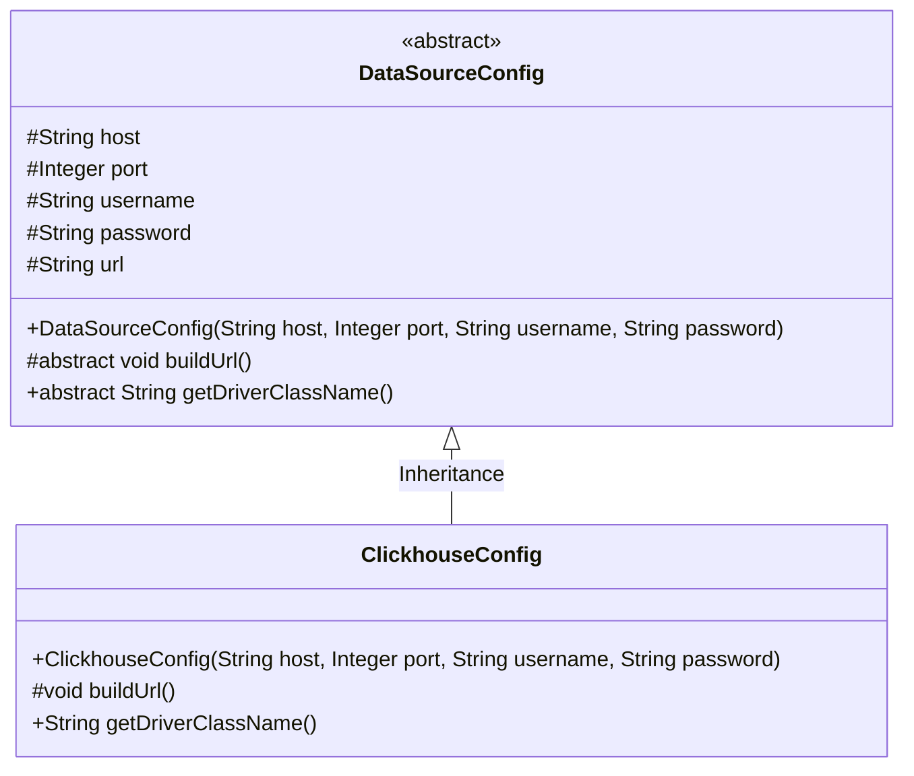
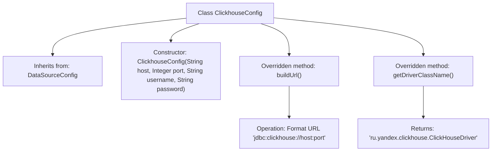

# Basic Information

|      |      |
|------|------|
| Name | ClickhouseConfig |
| Language | .java |
| Code Path | WeFe/common/java/common-wefe/src/main/java/com/welab/wefe/common/wefe/dto/storage/ClickhouseConfig.java |
| Package Name | com.welab.wefe.common.wefe.dto.storage |
| Dependencies | [] |
| Brief Description | ClickhouseConfig extends DataSourceConfig, initializes the host, port, username, and password through the constructor, constructs the JDBC connection URL for ClickHouse, and specifies the driver class name. |

# Description

The ClickhouseConfig class inherits from DataSourceConfig and is used to configure ClickHouse database connections. The constructor accepts the host address, port number, username, and password, and calls the parent class constructor for initialization. It overrides the buildUrl method to generate the JDBC connection URL for ClickHouse in the format jdbc:clickhouse://host:port. It also overrides the getDriverClassName method to return the JDBC driver class name for ClickHouse, ru.yandex.clickhouse.ClickHouseDriver.

# Class Summary

| Name   | Type  | Description |
|-------|------|-------------|
| ClickhouseConfig | class | ClickhouseConfig inherits from DataSourceConfig, initializes the database connection parameters through the constructor, overrides the buildUrl method to generate the JDBC connection URL for ClickHouse, and specifies the driver class name. |

## Class ClickhouseConfig

|      |      |
|------|------|
| Access Modifier | public |
| Type | class |
| Name | ClickhouseConfig |
| Description | ClickhouseConfig inherits from DataSourceConfig, initializes the database connection parameters through the constructor, overrides the buildUrl method to generate the JDBC connection URL for ClickHouse, and specifies the driver class name. |

### UML Class Diagram

This class diagram illustrates the inheritance relationship where the ClickhouseConfig class extends the abstract DataSourceConfig class. DataSourceConfig defines basic database connection parameters (host, port, etc.) and abstract methods, while ClickhouseConfig implements these abstract methods specifically for configuring ClickHouse database connections. The buildUrl() method constructs a ClickHouse-specific JDBC connection string, and getDriverClassName() returns the JDBC driver class name for ClickHouse. This design follows object-oriented inheritance principles, achieving a balance between generality and specificity in database configuration.

### Internal Method Call Graph

This flowchart illustrates the structure of the ClickhouseConfig class, which inherits from the DataSourceConfig class. It primarily includes a constructor and two overridden methods: buildUrl() for constructing the ClickHouse database connection URL, and getDriverClassName() which returns the JDBC driver class name for ClickHouse. The flow clearly presents the class inheritance relationship and method invocation paths, highlighting the implementation details of overriding parent class methods.

### Field List

| Name  | Type  | Description |
|-------|-------|------|

### Method List

| Name  | Type  | Description |
|-------|-------|------|
| buildUrl | void | Rewrite the buildUrl method to use String.format for concatenating the host and port to generate the ClickHouse database connection URL. |
| getDriverClassName | String | Java method override, returns the ClickHouse driver class name "ru.yandex.clickhouse.ClickHouseDriver". |

