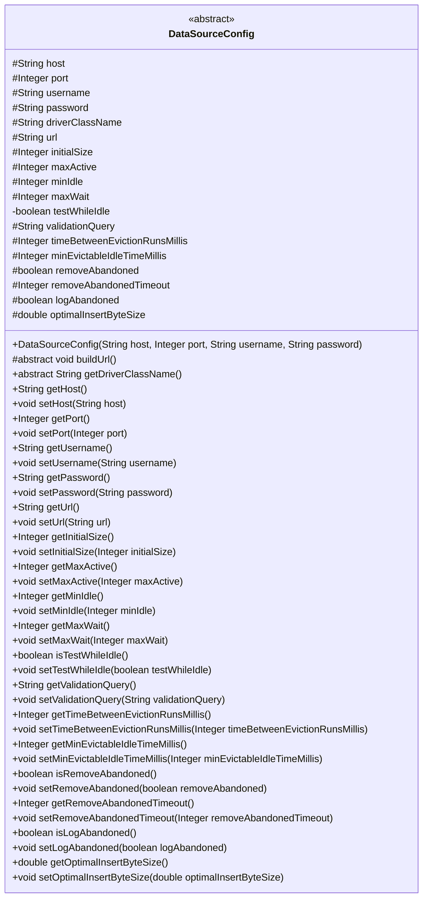
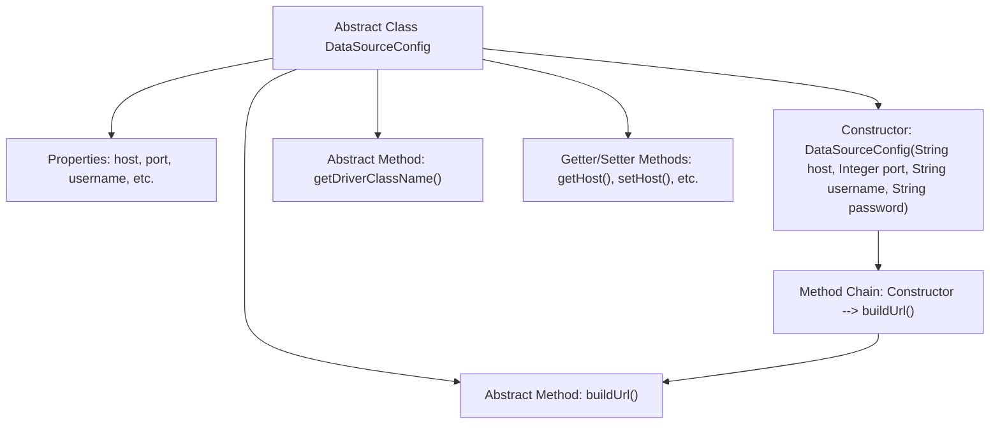

# Basic Information

|      |      |
|------|------|
| Name | DataSourceConfig |
| Language | .java |
| Code Path | WeFe/common/java/common-wefe/src/main/java/com/welab/wefe/common/wefe/dto/storage/DataSourceConfig.java |
| Package Name | com.welab.wefe.common.wefe.dto.storage |
| Dependencies | ['org.springframework.util.Assert'] |
| Brief Description | The abstract class DataSourceConfig defines the configuration for ClickHouse data sources, including host, port, authentication information, connection pool parameters, and URL construction methods, while providing default values and setter methods. |

# Description

This is an abstract class DataSourceConfig used for configuring data source connection parameters. It includes basic connection information such as host address, port, username, and password, as well as connection pool-related configurations like initial size, maximum active connections, and minimum idle connections. The class also defines parameters for connection validation, idle detection, abandoned connection handling, and provides configuration for the optimal batch insert byte size. The class enforces non-null parameters through its constructor and contains abstract methods buildUrl and getDriverClassName for subclasses to implement. All fields have corresponding getter and setter methods.

# Class Summary

| Name   | Type  | Description |
|-------|------|-------------|
| DataSourceConfig | class | The abstract class DataSourceConfig defines the ClickHouse data source configuration, including host, port, authentication, connection pool parameters, and batch insertion optimization settings, providing constructors and an abstract URL construction method. |

## Class DataSourceConfig

|      |      |
|------|------|
| Access Modifier | public abstract |
| Type | class |
| Name | DataSourceConfig |
| Description | The abstract class DataSourceConfig defines the ClickHouse data source configuration, including host, port, authentication, connection pool parameters, and batch insertion optimization settings, providing constructors and an abstract URL construction method. |

### UML Class Diagram

This code defines an abstract class `DataSourceConfig` for configuring data source connection parameters and connection pool parameters. The class includes basic connection information such as host address, port, username, and password, as well as connection pool configuration parameters like pool size and maximum wait time. The methods `buildUrl()` and `getDriverClassName()` are abstract and require implementation by subclasses. The class provides comprehensive getter and setter methods, allowing flexible configuration of various parameters, making it suitable for different types of database connection configurations.

### Internal Method Call Graph

This code defines an abstract class DataSourceConfig for configuring database connection parameters. The class includes multiple connection pool-related properties (such as host, port, connection limit, etc.) and corresponding getter/setter methods. The core functionality involves initializing basic connection parameters through the constructor and calling the abstract method buildUrl() to construct the connection string, while requiring subclasses to implement the getDriverClassName() method to obtain the driver class name. The flowchart illustrates the class structure, the relationships between properties and methods, and the call flow from the constructor to buildUrl().

### Field List

| Name  | Type  | Description |
|-------|-------|------|
| initialSize = 1 | Integer | An integer variable with initial size set to 1 and protected. |
| removeAbandonedTimeout = 60 | Integer | The connection pool removes idle connections with a timeout set to 60 seconds. |
| password | String | Declare a protected string variable password. |
| optimalInsertByteSize = 1 | double | The optimal insertion byte size is 1. |
| maxActive = 50 | Integer | The maximum number of active connections is limited to 50. |
| validationQuery = "SELECT 1" | String | Database connection validation query statement, used to check connection validity, defaults to executing "SELECT 1". |
| driverClassName | String | Declare a protected string variable driverClassName to store the driver class name. |
| port = 8123 | Integer | Protected integer variable for default port 8123. |
| host = "127.0.0.1" | String | The default host address is set to 127.0.0.1. |
| minIdle = 1 | Integer | The minimum number of idle connections is set to 1. |
| logAbandoned = true | boolean | Logging abandoned objects feature is enabled. |
| maxWait = 60000 | Integer | Define the protected integer variable maxWait with a default value of 60000 milliseconds. |
| username | String | Declare a protected string-type variable username. |
| removeAbandoned = true | boolean | Set the remove abandoned connection flag to true, indicating that automatic reclamation of improperly closed connections is allowed. |
| minEvictableIdleTimeMillis = 60000 | Integer | Configuration item: Minimum idle recycle time, default 60000 milliseconds (1 minute). |
| timeBetweenEvictionRunsMillis = 15000 | Integer | The idle connection check interval for the connection pool is set to 15 seconds. |
| testWhileIdle = false | boolean | The private boolean variable testWhileIdle has an initial value of false, which controls whether testing is performed during idle time. |
| url = "jdbc:clickhouse//127.0.0.1:8123" | String | The local URL for JDBC connection to ClickHouse is 127.0.0.1 with port 8123. |

### Method List

| Name  | Type  | Description |
|-------|-------|------|
| setRemoveAbandonedTimeout | void | The method to set the timeout for abandoned connections, with the parameter being of integer type. |
| isRemoveAbandoned | boolean | The method returns a boolean value removeAbandoned, indicating whether the abandoned object removal feature is enabled. |
| setPassword | void | The method to set the password assigns the input parameter to the class member variable `password`. |
| getInitialSize | Integer | Method for obtaining the initial size integer value. |
| getMaxActive | Integer | Method to obtain the maximum number of activities, returns the maxActive value. |
| getUsername | String | Methods to obtain the username string. |
| isLogAbandoned | boolean | The method isLogAbandoned returns a boolean value logAbandoned, indicating whether to log the abandoned status. |
| setRemoveAbandoned | void | Set whether to remove abandoned objects, the parameter is a boolean value. |
| getMaxWait | Integer | Get the integer value of the maximum waiting time. |
| getPort | Integer | Methods to obtain the port number, returns an integer value. |
| setHost | void | This is a Java method used to set the host property of a class. The method takes a string parameter host and assigns it to the member variable this.host of the class. |
| buildUrl | void | Abstract method for constructing URLs. |
| setTestWhileIdle | void | A boolean method to set whether to test the connection when idle. |
| isTestWhileIdle | boolean | The method `isTestWhileIdle` returns a boolean value `testWhileIdle`, which is used to check whether testing is performed while idle. |
| getMinIdle | Integer | Method to get the minimum number of idle connections, returns an integer value minIdle. |
| setTimeBetweenEvictionRunsMillis | void | Set the running interval (in milliseconds) for the idle object reclamation thread. |
| setMaxActive | void | The method to set the maximum number of active instances, with the parameter as maxActive, assigns the value to the class variable maxActive. |
| setLogAbandoned | void | A boolean parameter that sets whether to log deprecated connections. |
| getHost | String | Methods to obtain the host address, returning a string-type variable `host`. |
| getPassword | String | Methods to obtain the password, returns a string-type password. |
| getRemoveAbandonedTimeout | Integer | Get the timeout setting for removing stale connections. |
| setInitialSize | void | Public method to set initial size, with parameter of Integer type. |
| setValidationQuery | void | Set the method for validating query statements to update the `validationQuery` variable in the class. |
| setMaxWait | void | This is a Java method used to set the value of the maxWait property. The method takes an Integer parameter and assigns it to the maxWait member variable of the class. |
| setPort | void | The method to set the port number is to assign the parameter `port` to the class's `port` attribute. |
| getUrl | String | Methods to obtain URL strings. |
| getMinEvictableIdleTimeMillis | Integer | Method to obtain the minimum recyclable idle time in milliseconds. |
| getValidationQuery | String | The method to obtain the validation query string directly returns the value of the member variable validationQuery. |
| setOptimalInsertByteSize | void | The method to set the optimal insertion byte size assigns the input value to the class member variable `optimalInsertByteSize`. |
| setMinEvictableIdleTimeMillis | void | Set the minimum recyclable idle time for objects (in milliseconds). |
| getTimeBetweenEvictionRunsMillis | Integer | Get the idle connection detection interval time (in milliseconds) for the connection pool. |
| getDriverClassName | String | Abstract method, returns the driver class name. |
| setUrl | void | Method for setting the URL address: Assign the passed string parameter to the class's url variable. |
| getOptimalInsertByteSize | double | Method to obtain the optimal insertion byte size. |
| setUsername | void | A public method for setting the username, which assigns the input parameter to the class member variable username. |
| setMinIdle | void | Method to set the minimum number of idle connections, with the parameter being an integer minIdle. |

