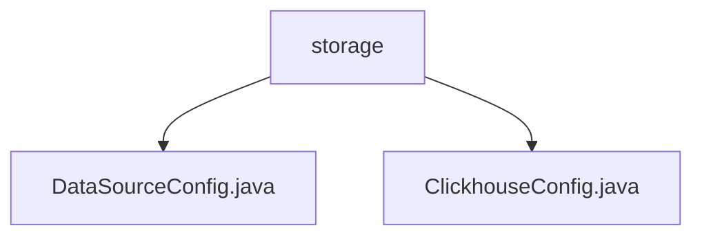

# Basic Information

|      |      |
|------|------|
| Name | storage |
| Language | .java |
| Code Path | WeFe/common/java/common-wefe/src/main/java/com/welab/wefe/common/wefe/dto/storage |
| Package Name | docs.common.java.common-wefe.src.main.java.com.welab.wefe.common.wefe.dto.storage |
| Brief Description | The abstract class DataSourceConfig configures data source connection parameters, including connection pool settings and validation functionality. ClickhouseConfig inherits from this class, implementing the JDBC connection URL and driver class name for ClickHouse. |

# Description

## Overview  
The core responsibility of this module is to provide a unified framework for data source connection configuration, supporting parameter management and URL construction for various database types (e.g., ClickHouse). The interface specifications include mandatory non-null parameter validation, connection pool configuration (e.g., initial size/maximum active connections), and abstract methods for driver class name/URL generation. Key data structures encompass basic connection parameters such as host address and port, as well as connection pool performance metrics. External dependencies are limited to JDBC drivers (e.g., ClickHouse's `ru.yandex.clickhouse.ClickHouseDriver`). For example, `ClickhouseConfig` implements specialized URL construction logic for ClickHouse through inheritance.

## Primary Business Scenarios  
The module is suitable for scenarios requiring multi-data-source management, where base configurations are unified via abstract classes, and subclasses customize database-specific differences (similar to the factory pattern). A typical workflow involves: mandatory parameter validation during initialization → connection pool configuration → generating database-specific URLs. The interaction pattern is implemented through inheritance; for instance, `ClickhouseConfig` overrides `buildUrl` to return a `jdbc:clickhouse://` format. Full functionality covers the entire lifecycle from parameter validation to driver loading, supporting advanced configurations such as batch insert optimization.

### Package Internal Structure View

This flowchart illustrates the file structure relationship under the `storage` directory in the WeFe project. The `storage` serves as the parent node, containing two child nodes: `DataSourceConfig.java` and `ClickhouseConfig.java` configuration class files. Both Java files belong to data storage-related configuration classes, residing at the same package path level, reflecting the modular design for configuring different database types in the project.

# File List

| Name   | Type  | Description |
|-------|------|-------------|
| [DataSourceConfig.java](DataSourceConfig.md) | file | The abstract class DataSourceConfig defines the configuration for ClickHouse data sources, including host, port, authentication information, connection pool parameters, and URL construction methods, while providing default values and setter methods. |
| [ClickhouseConfig.java](ClickhouseConfig.md) | file | ClickhouseConfig inherits from DataSourceConfig, initializes the host, port, username, and password through the constructor, constructs the JDBC connection URL for ClickHouse, and specifies the driver class name. |

