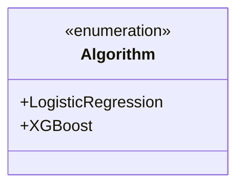
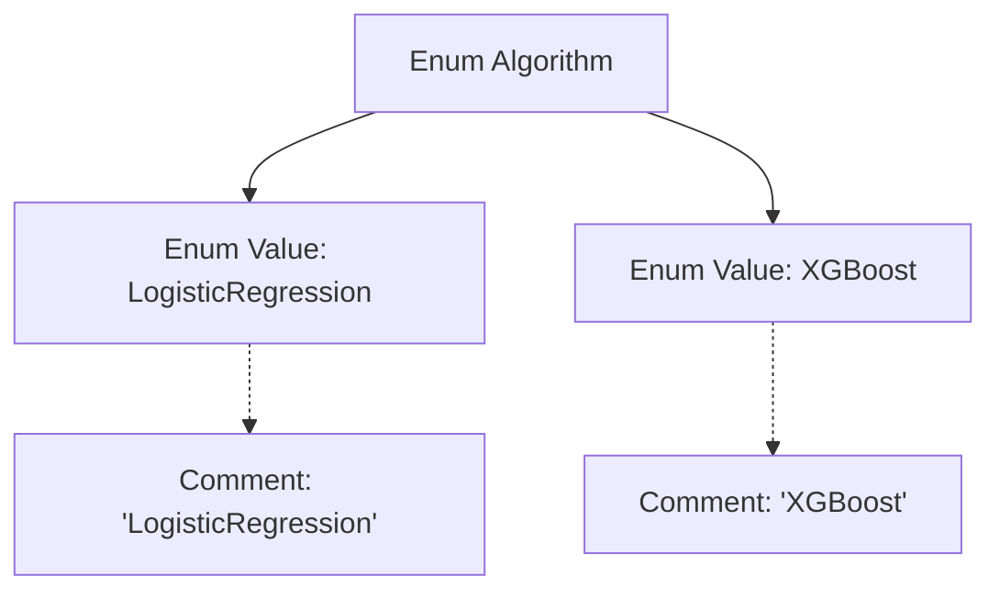

# Basic Information

|      |      |
|------|------|
| Name | Algorithm |
| Language | .java |
| Code Path | WeFe/common/java/common-wefe/src/main/java/com/welab/wefe/common/wefe/enums/Algorithm.java |
| Package Name | com.welab.wefe.common.wefe.enums |
| Dependencies | [] |
| Brief Description | An enum type Algorithm is defined, containing two algorithms: LogisticRegression and XGBoost. |

# Description

The content defines a public enumeration type named `Algorithm`, containing two enumeration values: `LogisticRegression` and `XGBoost`. These two enumeration values represent the logistic regression algorithm and the XGBoost algorithm, respectively, with brief explanations provided for each algorithm through comments. Enumeration types are typically used to represent a fixed set of related constants, and here they are used to denote different types of machine learning algorithms.

# Class Summary

| Name   | Type  | Description |
|-------|------|-------------|
| Algorithm | enum | The enum Algorithm contains two algorithms: LogisticRegression and XGBoost. |

## Class Algorithm

|      |      |
|------|------|
| Access Modifier | public |
| Type | enum |
| Name | Algorithm |
| Description | The enum Algorithm contains two algorithms: LogisticRegression and XGBoost. |

### UML Class Diagram

This code defines an enumeration type named Algorithm, containing two enum constants: LogisticRegression and XGBoost. Enumeration types are used to represent a fixed set of constant values, here likely used to specify types of machine learning algorithms. LogisticRegression represents the logistic regression algorithm, while XGBoost represents the gradient boosting decision tree algorithm. The use of enumeration types enhances code readability and type safety, avoiding the use of magic strings or numbers to represent algorithm types.

### Internal Method Call Graph

This flowchart illustrates the structure of the Algorithm enum, which contains two enum values: LogisticRegression and XGBoost, each with corresponding descriptive comments. As a special type of class, an enum is used to define a fixed set of constants, here representing two distinct algorithm types. The flowchart clearly demonstrates the definition of the enum and the relationships between its internal elements, with dashed lines connecting comments to enum values to indicate explanatory associations.

### Field List

| Name  | Type  | Description |
|-------|-------|------|

### Method List

| Name  | Type  | Description |
|-------|-------|------|

