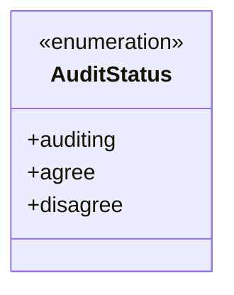
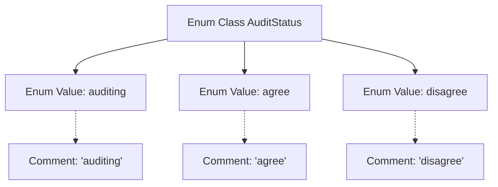

# Basic Information

|      |      |
|------|------|
| Name | AuditStatus |
| Language | .java |
| Code Path | WeFe/common/java/common-wefe/src/main/java/com/welab/wefe/common/wefe/enums/AuditStatus.java |
| Package Name | com.welab.wefe.common.wefe.enums |
| Dependencies | [] |
| Brief Description | The enumeration AuditStatus defines three states: auditing, agree, and disagree. |

# Description

The content defines an enumeration type named AuditStatus, which includes three enumeration values: "auditing" indicates under review, "agree" indicates approval, and "disagree" indicates rejection. Each enumeration value has corresponding comments explaining its meaning. This enumeration is used to represent different stages or outcomes of an audit status.

# Class Summary

| Name   | Type  | Description |
|-------|------|-------------|
| AuditStatus | enum | The enumeration AuditStatus defines three states: auditing (under review), agree (approved), and disagree (rejected). |

## Class AuditStatus

|      |      |
|------|------|
| Access Modifier | public |
| Type | enum |
| Name | AuditStatus |
| Description | The enumeration AuditStatus defines three states: auditing (under review), agree (approved), and disagree (rejected). |

### UML Class Diagram

This code defines an enumeration type named `AuditStatus`, containing three enum constants: `auditing` (under review), `agree` (approved), and `disagree` (rejected). Enumerations are used to represent a fixed set of states, with each state's meaning explained through Javadoc comments. This enumeration is suitable for scenarios requiring clear distinction of audit process states, such as workflow approvals, content moderation systems, etc. It replaces magic strings in a type-safe manner, enhancing code readability and maintainability.

### Internal Method Call Graph

This flowchart illustrates the structure of the AuditStatus enum class, which contains three enum values (auditing, agree, disagree) along with their corresponding comment descriptions. Each enum value is connected via dashed lines to its Javadoc comment, clearly demonstrating the definition approach and documentation standards for status enums. Such design is commonly used to represent business states with fixed options, such as approval statuses in workflow processes.

### Field List

| Name  | Type  | Description |
|-------|-------|------|

### Method List

| Name  | Type  | Description |
|-------|-------|------|

