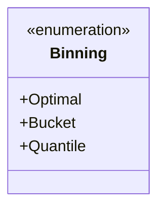
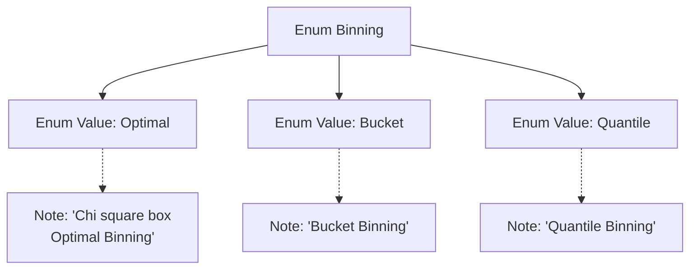

# Basic Information

|      |      |
|------|------|
| Name | Binning |
| Language | .java |
| Code Path | WeFe/common/java/common-wefe/src/main/java/com/welab/wefe/common/wefe/enums/Binning.java |
| Package Name | com.welab.wefe.common.wefe.enums |
| Dependencies | [] |
| Brief Description | The Binning enumeration includes three binning methods: Optimal (Chi-square optimal binning), Bucket (equal-width binning), and Quantile (equal-frequency binning). |

# Description

The content defines an enumeration type named Binning, which includes three binning methods: Optimal (Chi-square binning, optimal binning), Bucket (bucket binning), and Quantile (quantile binning). Each method is briefly described with comments explaining its characteristics.

# Class Summary

| Name   | Type  | Description |
|-------|------|-------------|
| Binning | enum | The Binning enumeration defines three binning methods: Optimal (Chi-square optimal binning), Bucket (equal-width binning), and Quantile (quantile binning). |

## Class Binning

|      |      |
|------|------|
| Access Modifier | public |
| Type | enum |
| Name | Binning |
| Description | The Binning enumeration defines three binning methods: Optimal (Chi-square optimal binning), Bucket (equal-width binning), and Quantile (quantile binning). |

### UML Class Diagram

This code defines an enumeration type named Binning, which includes three distinct binning methods: Optimal (Chi-square optimal binning), Bucket (equal-width binning), and Quantile (equal-frequency binning). In the class diagram, the enumeration type is marked with <<enumeration>>, listing all enumeration constants as public attributes. This design succinctly represents three strategy choices for data binning, suitable for discretizing continuous variables in feature engineering scenarios.

### Internal Method Call Graph

This flowchart illustrates the structure of the Binning enumeration, which includes three enum values (Optimal/Bucket/Quantile) along with their corresponding descriptive notes. The Optimal value has a detailed multi-line note describing its statistical properties, while the other two enum values have single-line notes explaining their binning strategies. The diagram clearly demonstrates the relationship between the enum definition and its documentation comments, showcasing the self-documenting nature of the code.

### Field List

| Name  | Type  | Description |
|-------|-------|------|

### Method List

| Name  | Type  | Description |
|-------|-------|------|

