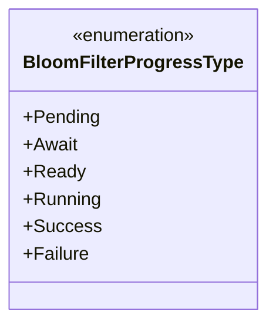
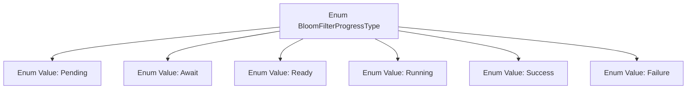

# Basic Information

|      |      |
|------|------|
| Name | BloomFilterProgressType |
| Language | .java |
| Code Path | WeFe/common/java/common-wefe/src/main/java/com/welab/wefe/common/wefe/enums/BloomFilterProgressType.java |
| Package Name | com.welab.wefe.common.wefe.enums |
| Dependencies | [] |
| Brief Description | The enumeration BloomFilterProgressType defines the progress states of a Bloom filter: pending, waiting, ready, running, success, failure. |

# Description

This enumeration type defines the different states of the Bloom filter processing procedure, comprising six specific state values: Pending indicates the initial state awaiting processing; Await signifies waiting for trigger conditions; Ready denotes being prepared and executable; Running represents the state of being in progress; Success indicates successful completion; and Failure signifies processing failure. These states comprehensively cover the critical nodes in the lifecycle of a Bloom filter.

# Class Summary

| Name   | Type  | Description |
|-------|------|-------------|
| BloomFilterProgressType | enum | The BloomFilterProgressType enum defines the progress states of a Bloom filter: pending, waiting, ready, running, success, failed. |

## Class BloomFilterProgressType

|      |      |
|------|------|
| Access Modifier | public |
| Type | enum |
| Name | BloomFilterProgressType |
| Description | The BloomFilterProgressType enum defines the progress states of a Bloom filter: pending, waiting, ready, running, success, failed. |

### UML Class Diagram

This code defines an enumeration class named `BloomFilterProgressType`, containing six enum constants: Pending, Await, Ready, Running, Success, and Failure. The enumeration represents different states in the processing lifecycle of a Bloom filter, from the initial pending state (Pending) to the final success (Success) or failure (Failure) outcome. Each enum constant corresponds to a specific phase, suitable for state tracking or workflow control scenarios.

### Internal Method Call Graph

This flowchart illustrates the structure of the BloomFilterProgressType enum, which includes six enum values: Pending, Await, Ready, Running, Success, and Failure. Each enum value is connected via an arrow extending from the main enum class, indicating they are members of this enum type. Such a structure is commonly used to represent different stages of a state machine or progress states of an operation, suitable for scenarios requiring clear distinction between discrete states.

### Field List

| Name  | Type  | Description |
|-------|-------|------|

### Method List

| Name  | Type  | Description |
|-------|-------|------|

