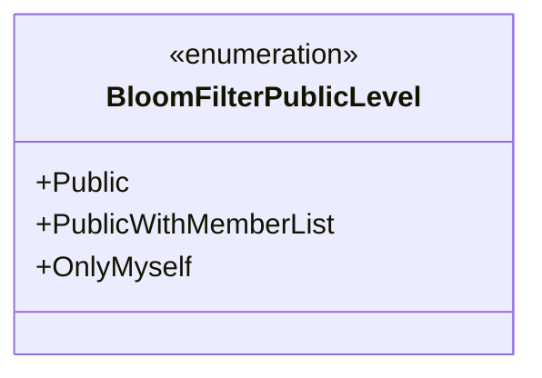
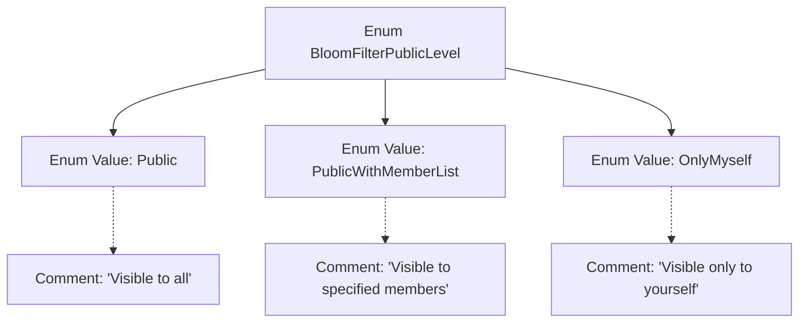

# Basic Information

|      |      |
|------|------|
| Name | BloomFilterPublicLevel |
| Language | .java |
| Code Path | WeFe/common/java/common-wefe/src/main/java/com/welab/wefe/common/wefe/enums/BloomFilterPublicLevel.java |
| Package Name | com.welab.wefe.common.wefe.enums |
| Dependencies | [] |
| Brief Description | The BloomFilterPublicLevel enum defines three visibility levels: visible to everyone, visible to specified members, and visible only to oneself. |

# Description

The content defines an enumeration type named BloomFilterPublicLevel, which includes three enumeration values. Public indicates visibility to all users, PublicWithMemberList indicates visibility only to specified members, and OnlyMyself indicates visibility only to the user themselves. Each enumeration value has corresponding comments explaining its scope of visibility.

# Class Summary

| Name   | Type  | Description |
|-------|------|-------------|
| BloomFilterPublicLevel | enum | The BloomFilterPublicLevel enum defines three visibility levels: public, visible to specified members, and visible only to oneself. |

## Class BloomFilterPublicLevel

|      |      |
|------|------|
| Access Modifier | public |
| Type | enum |
| Name | BloomFilterPublicLevel |
| Description | The BloomFilterPublicLevel enum defines three visibility levels: public, visible to specified members, and visible only to oneself. |

### UML Class Diagram

This enumeration class defines three public levels for Bloom filters: Public (fully public), PublicWithMemberList (visible to specified members), and OnlyMyself (visible only to oneself). Each enumeration value is accompanied by JavaDoc comments explaining its specific meaning, which is used to control the access scope of Bloom filter data. This design is commonly employed in scenarios requiring fine-grained permission management, such as privacy control modules in social networks or collaborative systems.

### Internal Method Call Graph

This flowchart illustrates the structure of the BloomFilterPublicLevel enum, which includes three enum values (Public, PublicWithMemberList, OnlyMyself) along with their corresponding comments. Public indicates visibility to all users, PublicWithMemberList indicates visibility to specified members, and OnlyMyself indicates visibility only to oneself. The arrow connections clearly depict the containment relationship between the enum class and its values, as well as the association between each enum value and its documentation comment.

### Field List

| Name  | Type  | Description |
|-------|-------|------|

### Method List

| Name  | Type  | Description |
|-------|-------|------|

