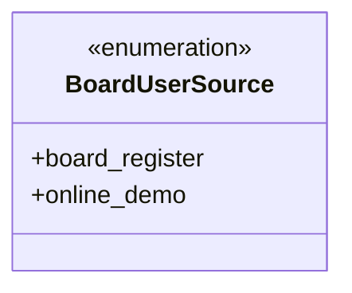
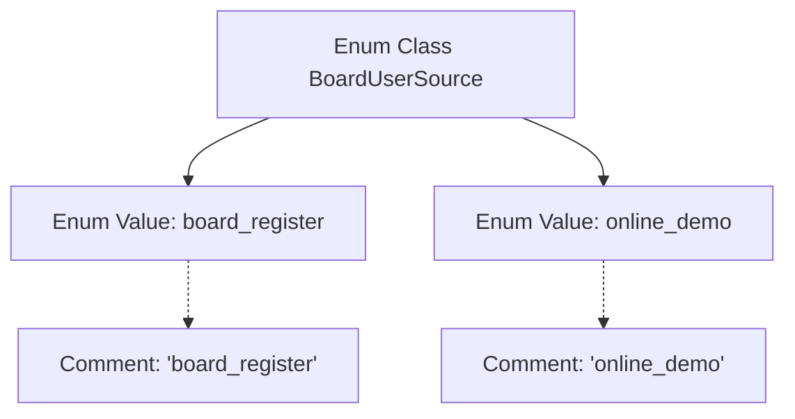

# Basic Information

|      |      |
|------|------|
| Name | BoardUserSource |
| Language | .java |
| Code Path | WeFe/common/java/common-wefe/src/main/java/com/welab/wefe/common/wefe/enums/BoardUserSource.java |
| Package Name | com.welab.wefe.common.wefe.enums |
| Dependencies | [] |
| Brief Description | The BoardUserSource enum defines user sources: board_register (registered users) and online_demo (online demo users). |

# Description

BoardUserSource is an enumeration type containing two members: board_register and online_demo. board_register indicates the user source as board registration, while online_demo indicates the user source as online demo. This enumeration is used to identify different user acquisition channels.

# Class Summary

| Name   | Type  | Description |
|-------|------|-------------|
| BoardUserSource | enum | The BoardUserSource enum defines user origins: board_register (registered users) and online_demo (online demo users). |

## Class BoardUserSource

|      |      |
|------|------|
| Access Modifier | public |
| Type | enum |
| Name | BoardUserSource |
| Description | The BoardUserSource enum defines user origins: board_register (registered users) and online_demo (online demo users). |

### UML Class Diagram

This code defines an enumeration type named BoardUserSource, containing two enumeration constants: board_register and online_demo. Enumeration types are used to represent a fixed set of constant values, which in this case likely serve to identify different user acquisition channels. board_register indicates users who joined via board registration, while online_demo denotes users who accessed the system through an online demo. In class diagrams, enumeration types are marked with <<enumeration>>, clearly demonstrating their special type characteristics and limited set of possible values.

### Internal Method Call Graph

This flowchart illustrates the structure of the BoardUserSource enum class, which contains two enum values: board_register and online_demo, each accompanied by corresponding comment descriptions. This enum class is likely used to distinguish user sources, where board_register represents users registered via the board, and online_demo represents online demo users. Such a design is commonly employed for identifying and categorizing system user sources, ensuring type safety and code readability through the use of enum types.

### Field List

| Name  | Type  | Description |
|-------|-------|------|

### Method List

| Name  | Type  | Description |
|-------|-------|------|

