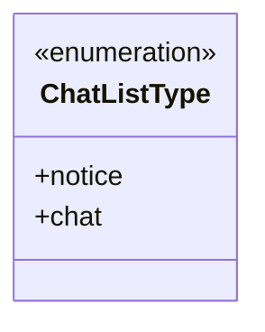
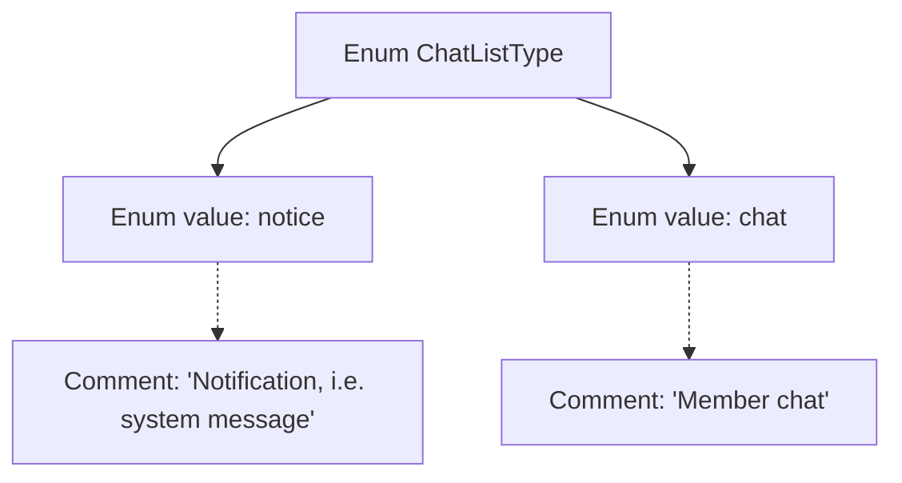

# Basic Information

|      |      |
|------|------|
| Name | ChatListType |
| Language | .java |
| Code Path | WeFe/common/java/common-wefe/src/main/java/com/welab/wefe/common/wefe/enums/ChatListType.java |
| Package Name | com.welab.wefe.common.wefe.enums |
| Dependencies | [] |
| Brief Description | Chat list type enumeration: notice indicates system notification messages, chat indicates member chat messages. |

# Description

The content defines an enumeration type named ChatListType, which includes two enum values: notice and chat. notice represents system notifications or messages, while chat represents member chats. The enumeration provides comments explaining the purpose of each value.

# Class Summary

| Name   | Type  | Description |
|-------|------|-------------|
| ChatListType | enum | Chat list type enumeration: notice indicates system notification messages, chat indicates member chat messages. |

## Class ChatListType

|      |      |
|------|------|
| Access Modifier | public |
| Type | enum |
| Name | ChatListType |
| Description | Chat list type enumeration: notice indicates system notification messages, chat indicates member chat messages. |

### UML Class Diagram

This code defines an enumeration type named ChatListType, containing two enum constants: notice and chat. notice represents system notification messages, while chat denotes regular member chat messages. In class diagrams, enumeration types are marked with <<enumeration>>, and their constants are listed as public members. This design is commonly used to represent fixed and limited type collections, ensuring type safety and improving code readability.

### Internal Method Call Graph

This flowchart illustrates the structure of the ChatListType enum, which contains two enum values: notice and chat, each accompanied by descriptive comments. The notice represents system notification messages, while chat denotes regular member chat messages. This enum is used to distinguish between different types of chat list items. Through clear enum value naming and comments, it specifies the purpose of each type, providing the code with good readability and type safety.

### Field List

| Name  | Type  | Description |
|-------|-------|------|

### Method List

| Name  | Type  | Description |
|-------|-------|------|

