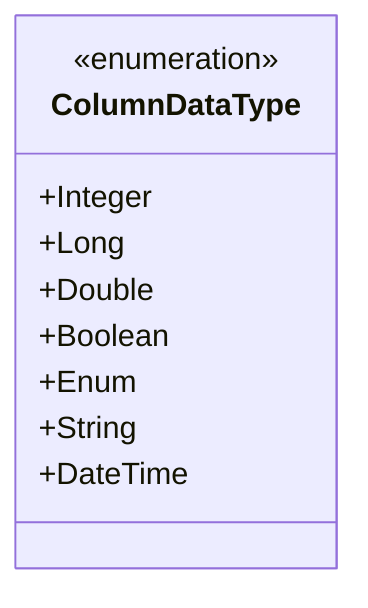
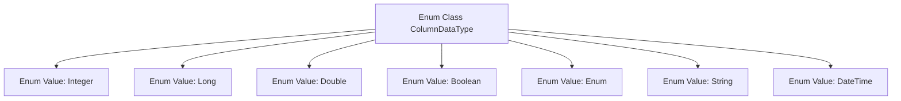

# Basic Information

|      |      |
|------|------|
| Name | ColumnDataType |
| Language | .java |
| Code Path | WeFe/common/java/common-wefe/src/main/java/com/welab/wefe/common/wefe/enums/ColumnDataType.java |
| Package Name | com.welab.wefe.common.wefe.enums |
| Dependencies | [] |
| Brief Description | The enumeration type ColumnDataType defines seven data types: Integer, Long, Double, Boolean, Enum, String, and DateTime. |

# Description

This enumeration defines the types of column data, including seven categories: Integer represents whole numbers, Long represents long integers, Double represents double-precision floating-point numbers, Boolean represents boolean values, Enum represents enumerated types, String represents text strings, and DateTime represents date and time. Each type is accompanied by a comment explaining its meaning.

# Class Summary

| Name   | Type  | Description |
|-------|------|-------------|
| ColumnDataType | enum | Define an enumeration for column data types, including integer, long integer, double precision, boolean, enumeration, string, and datetime. |

## Class ColumnDataType

|      |      |
|------|------|
| Access Modifier | public |
| Type | enum |
| Name | ColumnDataType |
| Description | Define an enumeration for column data types, including integer, long integer, double precision, boolean, enumeration, string, and datetime. |

### UML Class Diagram

This code defines an enumeration type named ColumnDataType, which represents different column data types. The enumeration includes 7 constant values: Integer (integer), Long (long integer), Double (double-precision floating-point), Boolean (boolean), Enum (enumeration), String (string), and DateTime (date and time). Such enumerations are typically used in database column type definitions or data format specification scenarios, ensuring type safety and consistency through predefined type sets. Each enumeration value corresponds to a specific data type, facilitating clear distinction and handling of different data formats in programs.

### Internal Method Call Graph

This flowchart illustrates the structure of the ColumnDataType enum class, which includes seven predefined data type enum values: Integer, Long, Double, Boolean, Enum, String, and DateTime. Each enum value is connected to the main class via arrows, indicating their membership in ColumnDataType. Such enum types are commonly used to define data type constraints for table columns or database fields, providing standardized type identifiers for the system.

### Field List

| Name  | Type  | Description |
|-------|-------|------|

### Method List

| Name  | Type  | Description |
|-------|-------|------|

