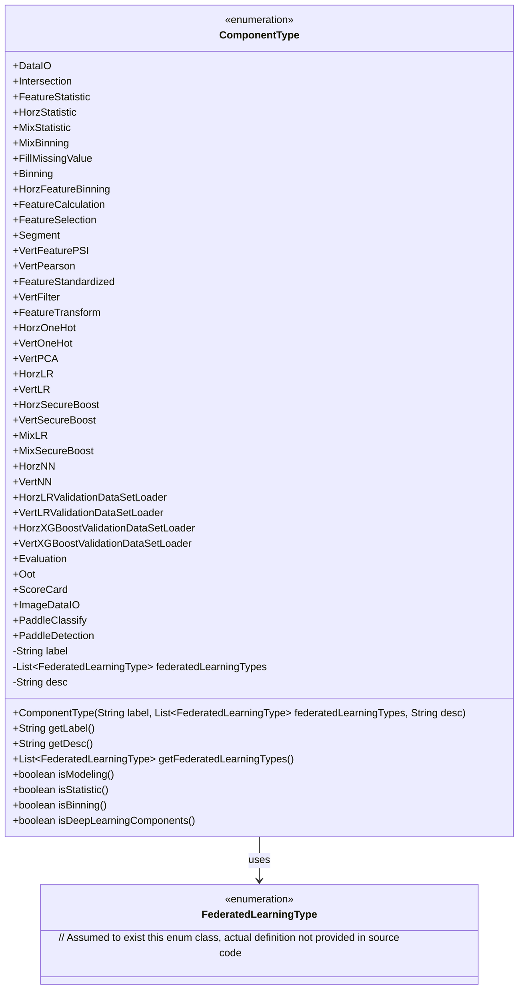

# Basic Information

|      |      |
|------|------|
| Name | ComponentType |
| Language | .java |
| Code Path | WeFe/common/java/common-wefe/src/main/java/com/welab/wefe/common/wefe/enums/ComponentType.java |
| Package Name | com.welab.wefe.common.wefe.enums |
| Dependencies | ['java.lang.reflect.Array', 'java.util.ArrayList', 'java.util.Arrays', 'java.util.Collections', 'java.util.List', 'com.welab.wefe.common.wefe.enums.FederatedLearningType.horizontal'] |
| Brief Description | Enumeration of Federated Learning Components, including data loading, feature processing, statistical analysis, modeling algorithms (Logistic Regression/XGBoost/Deep Learning), and evaluation types, supporting horizontal, vertical, and hybrid federated learning modes. |

# Description

This enumeration class defines the component types in a federated learning system, encompassing six major categories: data loading, preprocessing, statistical analysis, feature engineering, modeling algorithms, and evaluation. Each component includes a Chinese label, applicable federated learning type (horizontal/vertical/hybrid), and functional description. The modeling algorithms consist of three types: logistic regression, XGBoost, and deep learning, supporting different federated modes. Preprocessing includes feature binning, standardization, PSI calculation, etc. Special distinctions are made for the judgment methods of statistical, binning, and deep learning components. All components are managed through a static categorized list for quick identification of component attributes during system invocation.

# Class Summary

| Name   | Type  | Description |
|-------|------|-------------|
| ComponentType | enum | Enumeration of Federated Learning Components, including types such as data loading, feature processing, statistical analysis, modeling (logistic regression/XGBoost/deep learning), and evaluation, supporting horizontal, vertical, and hybrid federated learning modes. |

## Class ComponentType

|      |      |
|------|------|
| Access Modifier | public |
| Type | enum |
| Name | ComponentType |
| Description | Enumeration of Federated Learning Components, including types such as data loading, feature processing, statistical analysis, modeling (logistic regression/XGBoost/deep learning), and evaluation, supporting horizontal, vertical, and hybrid federated learning modes. |

### UML Class Diagram

This code defines an enumeration class `ComponentType` to represent various component types in a federated learning system. Each enum value corresponds to a functionally specific component, containing a Chinese label, applicable federated learning type list, and description. The class provides judgment methods (e.g., `isModeling()`) to check whether a component belongs to specific categories (modeling, statistics, binning, or deep learning). The class has a dependency relationship with the `FederatedLearningType` enumeration to limit the applicable scope of components. The overall structure clearly organizes various functional components in federated learning workflows.

### Internal Method Call Graph

```mermaid
graph TD
    A["Enum ComponentType"]
    B["Static List: MODELING_TYPES"]
    C["Static List: STATISTIC_TYPES"]
    D["Static List: BINNING_TYPES"]
    E["Static List: DeepLearningComponents"]
    F["Property: String label"]
    G["Property: List<FederatedLearningType> federatedLearningTypes"]
    H["Property: String desc"]
    I["Constructor: ComponentType(String label, List<FederatedLearningType> federatedLearningTypes, String desc)"]
    J["Method: String getLabel()"]
    K["Method: String getDesc()"]
    L["Method: List<FederatedLearningType> getFederatedLearningTypes()"]
    M["Method: boolean isModeling()"]
    N["Method: boolean isStatistic()"]
    O["Method: boolean isBinning()"]
    P["Method: boolean isDeepLearningComponents()"]

    A --> B
    A --> C
    A --> D
    A --> E
    A --> F
    A --> G
    A --> H
    A --> I
    A --> J
    A --> K
    A --> L
    A --> M
    A --> N
    A --> O
    A --> P
```

This flowchart illustrates the structure of the ComponentType enum class, which contains 4 static component classification lists, 3 properties, and 7 methods. The enum defines various component types in a federated learning system, including data loading, feature processing, modeling algorithms, etc. It implements component classification judgment functions (e.g., isModeling()) through static lists and methods. The flowchart clearly presents the hierarchical relationships among internal elements of the enum.

### Field List

| Name  | Type  | Description |
|-------|-------|------|

### Method List

| Name  | Type  | Description |
|-------|-------|------|

