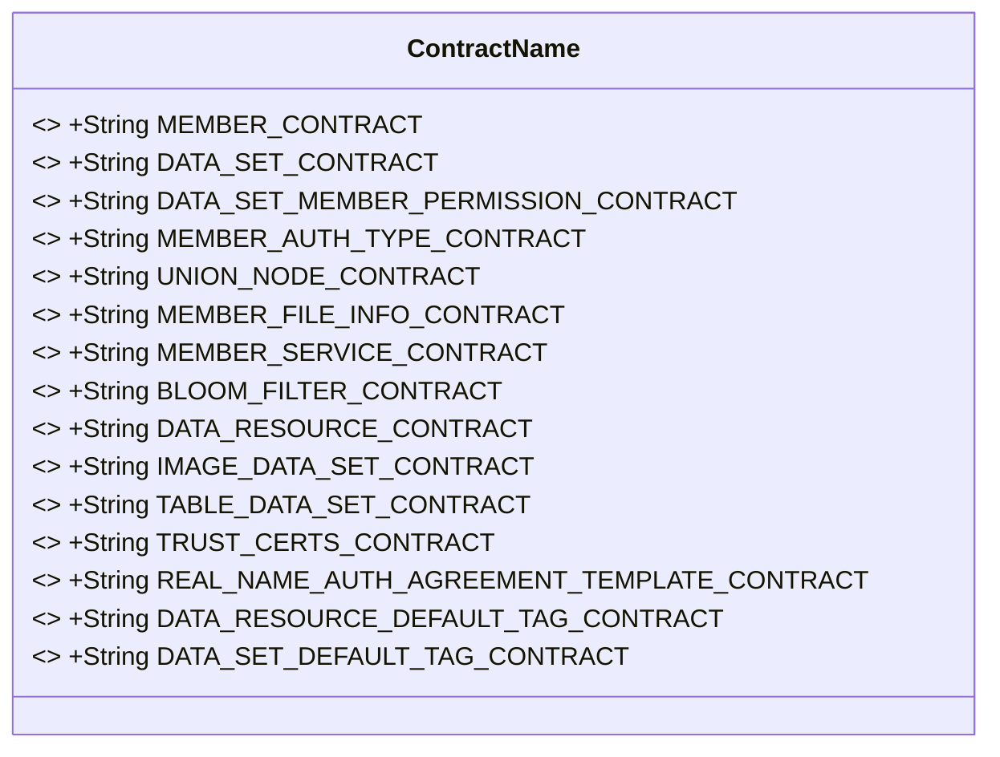

# Basic Information

|      |      |
|------|------|
| Name | ContractName |
| Language | .java |
| Code Path | WeFe/common/java/common-wefe/src/main/java/com/welab/wefe/common/wefe/enums/ContractName.java |
| Package Name | com.welab.wefe.common.wefe.enums |
| Dependencies | [] |
| Brief Description | The `ContractName` class contains multiple static string constants that define different contract names, such as member, dataset, permission, real-name authentication, data source, etc. |

# Description

The code defines a public class named `ContractName`, which contains multiple static constant strings representing different types of contract names. These contracts cover various domains, including member management, datasets, permission control, real-name authentication, file services, and data resource classification. Specifically, they include the Member Contract, Dataset Contract, Member Dataset Permission Contract, Real-name Type Contract, Union Node Contract, Member File Information Contract, Member Service Contract, Bloom Filter Contract, Data Source Contract, Image Resource Contract, Two-dimensional Table Resource Contract, CA Certificate Contract, Real-name Authentication Protocol Template Contract, and two types of Dataset Label Contracts. These constants are used to uniformly identify the contract names of different functional modules in the system.

# Class Summary

| Name   | Type  | Description |
|-------|------|-------------|
| ContractName | class | The ContractName class defines multiple static constant strings representing contract names for different functionalities, including member, dataset, permission, real-name authentication, node, file, service, filter, data source, image, table, certificate, tag, etc. |

## Class ContractName

|      |      |
|------|------|
| Access Modifier | public |
| Type | class |
| Name | ContractName |
| Description | The ContractName class defines multiple static constant strings representing contract names for different functionalities, including member, dataset, permission, real-name authentication, node, file, service, filter, data source, image, table, certificate, tag, etc. |

### UML Class Diagram

### Internal Method Call Graph

```mermaid
graph TD
    A["Class ContractName"]
    B["Constant: MEMBER_CONTRACT = 'MemberContract'"]
    C["Constant: DATA_SET_CONTRACT = 'DataSetContract'"]
    D["Constant: DATA_SET_MEMBER_PERMISSION_CONTRACT = 'DataSetMemberPermissionContract'"]
    E["Constant: MEMBER_AUTH_TYPE_CONTRACT = 'MemberAuthTypeContract'"]
    F["Constant: UNION_NODE_CONTRACT = 'UnionNodeContract'"]
    G["Constant: MEMBER_FILE_INFO_CONTRACT = 'MemberFileInfoContract'"]
    H["Constant: MEMBER_SERVICE_CONTRACT = 'MemberServiceContract'"]
    I["Constant: BLOOM_FILTER_CONTRACT = 'BloomFilterContract'"]
    J["Constant: DATA_RESOURCE_CONTRACT = 'DataResourceContract'"]
    K["Constant: IMAGE_DATA_SET_CONTRACT = 'ImageDataSetContract'"]
    L["Constant: TABLE_DATA_SET_CONTRACT = 'TableDataSetContract'"]
    M["Constant: TRUST_CERTS_CONTRACT = 'TrustCertsContract'"]
    N["Constant: REAL_NAME_AUTH_AGREEMENT_TEMPLATE_CONTRACT = 'RealnameAuthAgreementTemplateContract'"]
    O["Constant: DATA_RESOURCE_DEFAULT_TAG_CONTRACT = 'DataResourceDefaultTagContract'"]
    P["Constant: DATA_SET_DEFAULT_TAG_CONTRACT = 'DataSetDefaultTagContract'"]

    A --> B
    A --> C
    A --> D
    A --> E
    A --> F
    A --> G
    A --> H
    A --> I
    A --> J
    A --> K
    A --> L
    A --> M
    A --> N
    A --> O
    A --> P
```

This flowchart illustrates 14 public static constant strings defined in the ContractName class, each representing a specific contract name. These constants centralize the management of identifier names for various contracts in the system, including member contracts, dataset contracts, permission contracts, etc. By using constant definitions, it avoids hard-coded strings and enhances code maintainability and readability. All constants are named in uppercase and accessed directly through the class name.

### Field List

| Name  | Type  | Description |
|-------|-------|------|
| MEMBER_SERVICE_CONTRACT = "MemberServiceContract" | String | Member Service Contract Constant Definitions |
| DATA_SET_CONTRACT = "DataSetContract" | String | Define a constant string DATA_SET_CONTRACT with the value "DataSetContract". |
| IMAGE_DATA_SET_CONTRACT = "ImageDataSetContract" | String | Define a public static constant string IMAGE_DATA_SET_CONTRACT with the value "ImageDataSetContract". |
| REAL_NAME_AUTH_AGREEMENT_TEMPLATE_CONTRACT = "RealnameAuthAgreementTemplateContract" | String | This is a Java constant representing the name of the real-name authentication agreement template contract. |
| TRUST_CERTS_CONTRACT = "TrustCertsContract" | String | Defined an immutable public static string constant TRUST_CERTS_CONTRACT with the value "TrustCertsContract". |
| DATA_RESOURCE_CONTRACT = "DataResourceContract" | String | Define the constant string DATA_RESOURCE_CONTRACT with the value "DataResourceContract". |
| DATA_SET_MEMBER_PERMISSION_CONTRACT = "DataSetMemberPermissionContract" | String | Constant string, representing the name of the dataset member permission contract. |
| TABLE_DATA_SET_CONTRACT = "TableDataSetContract" | String | Define a constant string TABLE_DATA_SET_CONTRACT with the value "TableDataSetContract". |
| MEMBER_AUTH_TYPE_CONTRACT = "MemberAuthTypeContract" | String | Define the constant string MEMBER_AUTH_TYPE_CONTRACT, indicating that the member authentication type is contract. |
| DATA_RESOURCE_DEFAULT_TAG_CONTRACT = "DataResourceDefaultTagContract" | String | The constant string "DataResourceDefaultTagContract" is used to identify the default tag contract of a data resource. |
| MEMBER_CONTRACT = "MemberContract" | String | Defined a public static constant string MEMBER_CONTRACT with the value "MemberContract". |
| UNION_NODE_CONTRACT = "UnionNodeContract" | String | Define a public static constant string UNION_NODE_CONTRACT with the value "UnionNodeContract". |
| BLOOM_FILTER_CONTRACT = "BloomFilterContract" | String | Define the constant string BLOOM_FILTER_CONTRACT with the value "BloomFilterContract". |
| MEMBER_FILE_INFO_CONTRACT = "MemberFileInfoContract" | String | Defined a public static constant string MEMBER_FILE_INFO_CONTRACT with the value "MemberFileInfoContract". |
| DATA_SET_DEFAULT_TAG_CONTRACT = "DataSetDefaultTagContract" | String | Define the static constant string DATA_SET_DEFAULT_TAG_CONTRACT with the value "DataSetDefaultTagContract". |

### Method List

| Name  | Type  | Description |
|-------|-------|------|

