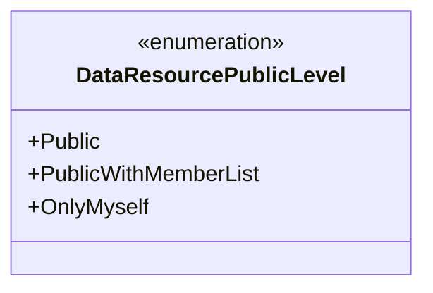
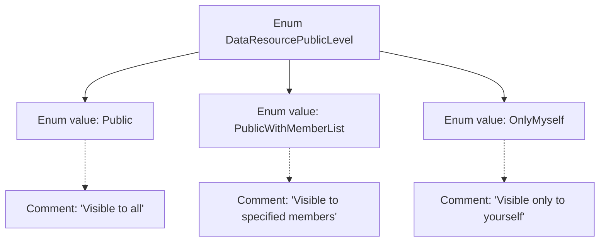

# Basic Information

|      |      |
|------|------|
| Name | DataResourcePublicLevel |
| Language | .java |
| Code Path | WeFe/common/java/common-wefe/src/main/java/com/welab/wefe/common/wefe/enums/DataResourcePublicLevel.java |
| Package Name | com.welab.wefe.common.wefe.enums |
| Dependencies | [] |
| Brief Description | Data resource visibility level enumeration: Public (visible to all), PublicWithMemberList (visible to specified members), OnlyMyself (visible only to self). |

# Description

This enumeration defines the disclosure levels of data resources, comprising three options: Public indicates visibility to all users; PublicWithMemberList indicates visibility only to specified members; OnlyMyself indicates visibility solely to the user themselves. Each option includes clear annotations specifying its scope of visibility.

# Class Summary

| Name   | Type  | Description |
|-------|------|-------------|
| DataResourcePublicLevel | enum | The DataResourcePublicLevel enum defines the data resource visibility levels: Public (visible to everyone), PublicWithMemberList (visible to specified members), and OnlyMyself (visible only to myself). |

## Class DataResourcePublicLevel

|      |      |
|------|------|
| Access Modifier | public |
| Type | enum |
| Name | DataResourcePublicLevel |
| Description | The DataResourcePublicLevel enum defines the data resource visibility levels: Public (visible to everyone), PublicWithMemberList (visible to specified members), and OnlyMyself (visible only to myself). |

### UML Class Diagram

This class diagram illustrates an enumeration type `DataResourcePublicLevel`, which defines three levels of data resource visibility: `Public` indicates visibility to all users, `PublicWithMemberList` specifies visibility only to a designated member list, and `OnlyMyself` restricts visibility solely to the resource owner. The enumeration type is explicitly marked with the <<enumeration>> stereotype, with all enumeration values being public constants used to granularly control data access permissions. This design is commonly employed in system architectures requiring fine-grained permission management.

### Internal Method Call Graph

This flowchart illustrates the structure of the DataResourcePublicLevel enumeration, which includes three enum values (Public, PublicWithMemberList, OnlyMyself) along with their corresponding comments. Public indicates the resource is visible to all users, PublicWithMemberList means visible only to specified members, and OnlyMyself denotes visibility limited to the resource owner. The arrow connections represent the hierarchical relationship between the enumeration class and its values with annotations, clearly presenting the permission definitions for different visibility levels.

### Field List

| Name  | Type  | Description |
|-------|-------|------|

### Method List

| Name  | Type  | Description |
|-------|-------|------|

