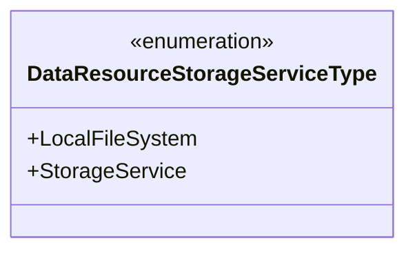
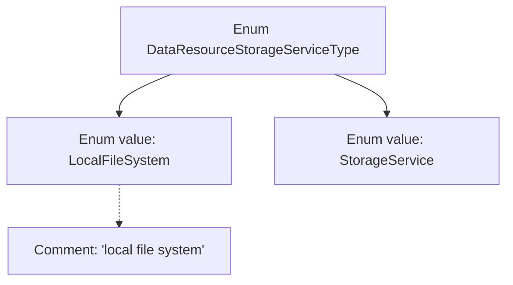

# Basic Information

|      |      |
|------|------|
| Name | DataResourceStorageServiceType |
| Language | .java |
| Code Path | WeFe/common/java/common-wefe/src/main/java/com/welab/wefe/common/wefe/enums/DataResourceStorageServiceType.java |
| Package Name | com.welab.wefe.common.wefe.enums |
| Dependencies | [] |
| Brief Description | The enumeration DataResourceStorageServiceType defines two storage types: local file system and storage service. |

# Description

The content defines an enumeration type named DataResourceStorageServiceType, which includes two enumeration values: LocalFileSystem and StorageService. Here, LocalFileSystem represents the local file system storage method, while StorageService denotes the general storage service type. The enumeration is used to identify different types of data resource storage services.

# Class Summary

| Name   | Type  | Description |
|-------|------|-------------|
| DataResourceStorageServiceType | enum | Enumeration defines the data resource storage service types, including two options: local file system and storage service. |

## Class DataResourceStorageServiceType

|      |      |
|------|------|
| Access Modifier | public |
| Type | enum |
| Name | DataResourceStorageServiceType |
| Description | Enumeration defines the data resource storage service types, including two options: local file system and storage service. |

### UML Class Diagram

This code defines an enumeration type named DataResourceStorageServiceType, which includes two enum constants: LocalFileSystem and StorageService. LocalFileSystem indicates the use of a local file system as the data storage service, while StorageService represents a generic storage service type. In the class diagram, the enumeration type is marked with <<enumeration>>, clearly displaying its finite set of values and simple structure. This design is commonly used to represent fixed service types or configuration options, facilitating type-safe management of different storage service implementations.

### Internal Method Call Graph

This flowchart illustrates the structure of the DataResourceStorageServiceType enum, which includes two enum values: LocalFileSystem and StorageService. The LocalFileSystem value is annotated with a comment indicating it represents the local file system. As a special data type, enums are used to define a set of fixed constants. Here, they clearly distinguish between two different types of data storage services, facilitating clear reference and maintenance in code.

### Field List

| Name  | Type  | Description |
|-------|-------|------|

### Method List

| Name  | Type  | Description |
|-------|-------|------|

