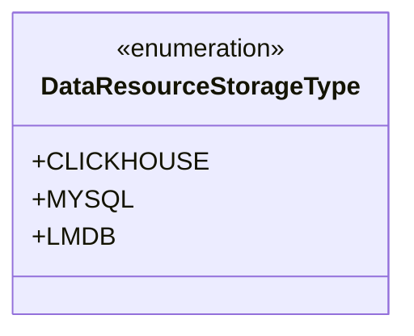
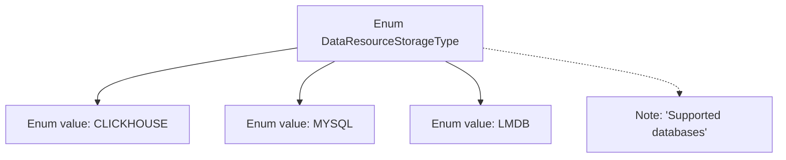

# Basic Information

|      |      |
|------|------|
| Name | DataResourceStorageType |
| Language | .java |
| Code Path | WeFe/common/java/common-wefe/src/main/java/com/welab/wefe/common/wefe/enums/DataResourceStorageType.java |
| Package Name | com.welab.wefe.common.wefe.enums |
| Dependencies | [] |
| Brief Description | Data resource storage type enumeration: Supports CLICKHOUSE, MYSQL, and LMDB databases. |

# Description

The content defines a public enumeration type named DataResourceStorageType, which includes three database storage types: CLICKHOUSE, MYSQL, and LMDB. The comments indicate that these are the supported database types. The enumeration is used to represent different data resource storage methods and does not include specific implementation details.

# Class Summary

| Name   | Type  | Description |
|-------|------|-------------|
| DataResourceStorageType | enum | The DataResourceStorageType enumeration defines the supported database types: CLICKHOUSE, MYSQL, and LMDB. |

## Class DataResourceStorageType

|      |      |
|------|------|
| Access Modifier | public |
| Type | enum |
| Name | DataResourceStorageType |
| Description | The DataResourceStorageType enumeration defines the supported database types: CLICKHOUSE, MYSQL, and LMDB. |

### UML Class Diagram

This code defines an enumeration type named DataResourceStorageType, which contains three enum constants: CLICKHOUSE, MYSQL, and LMDB. Enumeration types are used to represent a fixed set of constant values, here explicitly specifying three supported database types. In class diagrams, enumeration types are marked with <<enumeration>>, and their constant values are listed as public static members. This design is commonly used to restrict the range of valid data resource storage types, ensuring type safety and code readability.

### Internal Method Call Graph

This code defines an enumeration type named DataResourceStorageType, which includes three enum values: CLICKHOUSE, MYSQL, and LMDB, along with a note indicating these are supported database types. The flowchart illustrates the containment relationship between the enum class and its values, as well as the association between the note and the enum class. This enumeration may be used to identify or select different types of data storage resources, suitable for scenarios where storage types need to be explicitly defined.

### Field List

| Name  | Type  | Description |
|-------|-------|------|

### Method List

| Name  | Type  | Description |
|-------|-------|------|

