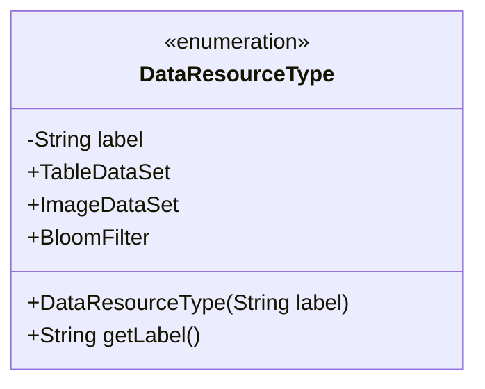
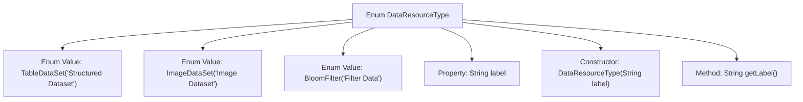

# Basic Information

|      |      |
|------|------|
| Name | DataResourceType |
| Language | .java |
| Code Path | WeFe/common/java/common-wefe/src/main/java/com/welab/wefe/common/wefe/enums/DataResourceType.java |
| Package Name | com.welab.wefe.common.wefe.enums |
| Dependencies | [] |
| Brief Description | The DataResourceType enum defines three types of data: structured datasets (conventional machine learning), image datasets (deep learning), and filter data (Bloom filter). |

# Description

This enumeration defines three types of data resources: TableDataSet represents structured datasets, suitable for conventional machine learning; ImageDataSet denotes image datasets, used for deep learning; BloomFilter indicates filter data. Each type has a corresponding Chinese label, which can be obtained via the getLabel method. The enumeration ensures the immutability of labels through a private constructor.

# Class Summary

| Name   | Type  | Description |
|-------|------|-------------|
| DataResourceType | enum | The enumeration DataResourceType defines three data types: TableDataSet (structured dataset), ImageDataSet (image dataset), and BloomFilter (filter data), each with corresponding labels. |

## Class DataResourceType

|      |      |
|------|------|
| Access Modifier | public |
| Type | enum |
| Name | DataResourceType |
| Description | The enumeration DataResourceType defines three data types: TableDataSet (structured dataset), ImageDataSet (image dataset), and BloomFilter (filter data), each with corresponding labels. |

### UML Class Diagram

This diagram illustrates an enumeration class `DataResourceType`, which defines three types of data resources: structured dataset, image dataset, and filter data. Each enumeration value has an associated label description stored in the private field `label` and accessed via the public method `getLabel()`. The enumeration class initializes label values through its constructor, making it suitable for scenarios requiring explicit classification of data source types.

### Internal Method Call Graph

This code defines an enum type named DataResourceType, which includes three enum values: TableDataSet (Structured Dataset), ImageDataSet (Image Dataset), and BloomFilter (Filter Data). Each enum value has an associated label string initialized via the constructor and provides a getLabel() method to retrieve the label. The enum is used to represent different types of data resources, applicable to machine learning, deep learning, and filtering scenarios. The flowchart clearly illustrates the hierarchical relationships between the enum structure, properties, constructor, and methods.

### Field List

| Name  | Type  | Description |
|-------|-------|------|

### Method List

| Name  | Type  | Description |
|-------|-------|------|

