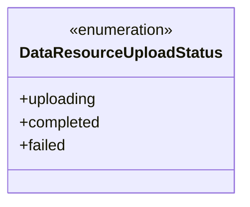
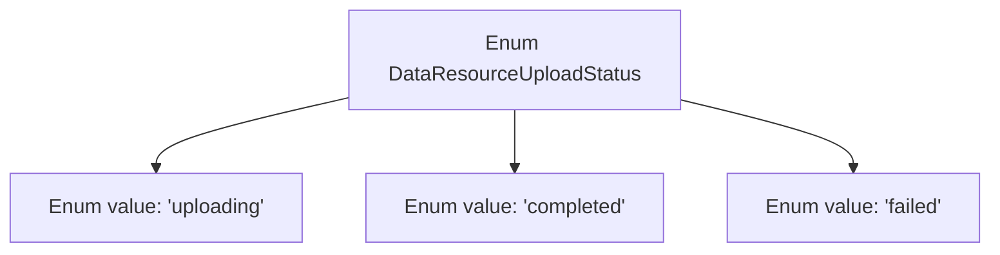

# Basic Information

|      |      |
|------|------|
| Name | DataResourceUploadStatus |
| Language | .java |
| Code Path | WeFe/common/java/common-wefe/src/main/java/com/welab/wefe/common/wefe/enums/DataResourceUploadStatus.java |
| Package Name | com.welab.wefe.common.wefe.enums |
| Dependencies | [] |
| Brief Description | Data resource upload status enumeration: Uploading, Completed, Failed. |

# Description

The content defines a public enumeration type named DataResourceUploadStatus, which includes three status values: "uploading" indicates the data resource is currently being uploaded, "completed" indicates the upload has finished, and "failed" indicates the upload has failed. The enumeration is used to describe different states during the data resource upload process.

# Class Summary

| Name   | Type  | Description |
|-------|------|-------------|
| DataResourceUploadStatus | enum | Data resource upload status enumeration: Uploading, Completed, Failed. |

## Class DataResourceUploadStatus

|      |      |
|------|------|
| Access Modifier | public |
| Type | enum |
| Name | DataResourceUploadStatus |
| Description | Data resource upload status enumeration: Uploading, Completed, Failed. |

### UML Class Diagram

This enumeration class defines three states for data resource upload: uploading, completed, and failed. As an enumeration type, it ensures the uniqueness and safety of state types through fixed constant values, commonly used for status tracking in scenarios such as file uploads and data processing. Enum instances inherently possess ordinal and name properties, and all enum values can be retrieved via the values() method. This design eliminates magic strings, enhancing code readability and maintainability.

### Internal Method Call Graph

This flowchart illustrates the structure of the DataResourceUploadStatus enum, which contains three fixed states: 'uploading' (in progress), 'completed' (finished), and 'failed'. Each enum value is connected to the main enum as an independent node, representing all possible instance values of this enum type. This design is commonly used to represent finite and well-defined state collections, suitable for scenarios like file uploads that require explicit status tracking.

### Field List

| Name  | Type  | Description |
|-------|-------|------|

### Method List

| Name  | Type  | Description |
|-------|-------|------|

