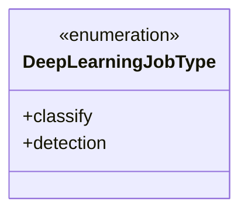
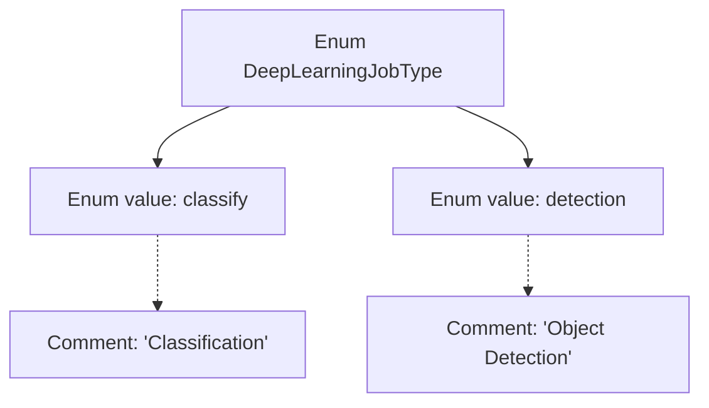

# Basic Information

|      |      |
|------|------|
| Name | DeepLearningJobType |
| Language | .java |
| Code Path | WeFe/common/java/common-wefe/src/main/java/com/welab/wefe/common/wefe/enums/DeepLearningJobType.java |
| Package Name | com.welab.wefe.common.wefe.enums |
| Dependencies | [] |
| Brief Description | The DeepLearningJobType enum defines two types of deep learning tasks: classification and object detection. |

# Description

The content defines a public enumeration type named DeepLearningJobType, containing two enumeration values: classify and detection. classify represents a classification task, while detection represents an object detection task. Each enumeration value is accompanied by corresponding Chinese comments explaining its purpose. This enumeration is used to distinguish between different types of deep learning tasks.

# Class Summary

| Name   | Type  | Description |
|-------|------|-------------|
| DeepLearningJobType | enum | The DeepLearningJobType enumeration defines two types of deep learning tasks: classification and object detection. |

## Class DeepLearningJobType

|      |      |
|------|------|
| Access Modifier | public |
| Type | enum |
| Name | DeepLearningJobType |
| Description | The DeepLearningJobType enumeration defines two types of deep learning tasks: classification and object detection. |

### UML Class Diagram

This code defines an enumeration type named DeepLearningJobType, containing two enum constants: classify (classification) and detection (object detection). Enumeration types are used to represent a fixed set of constant values, specifically here for identifying types of deep learning tasks. This enumeration does not define any methods or additional attributes, serving solely as a type identifier, making it suitable for use in code that requires clear differentiation between various deep learning task scenarios. The concise design of the enumeration ensures ease of extension and maintenance while guaranteeing type safety.

### Internal Method Call Graph

This flowchart illustrates the structure of the DeepLearningJobType enum, containing two enum values classify and detection, corresponding to the comment descriptions "Classification" and "Object Detection" respectively. As a special class type, the enum demonstrates its static member relationships through graph TD, with comments linked to corresponding enum values via dashed arrows. The overall structure clearly presents the definition method of deep learning task types.

### Field List

| Name  | Type  | Description |
|-------|-------|------|

### Method List

| Name  | Type  | Description |
|-------|-------|------|

