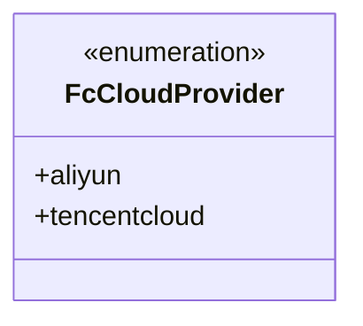
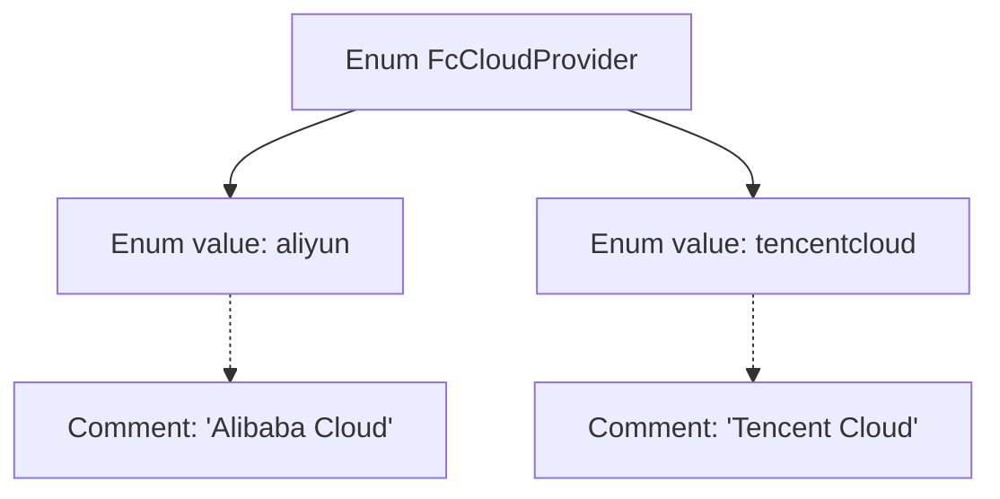

# Basic Information

|      |      |
|------|------|
| Name | FcCloudProvider |
| Language | .java |
| Code Path | WeFe/common/java/common-wefe/src/main/java/com/welab/wefe/common/wefe/enums/FcCloudProvider.java |
| Package Name | com.welab.wefe.common.wefe.enums |
| Dependencies | [] |
| Brief Description | The enumeration FcCloudProvider defines two cloud service providers: Alibaba Cloud and Tencent Cloud. |

# Description

The code defines an enumeration type named `FcCloudProvider`, which includes two enumeration values: `aliyun` represents Alibaba Cloud, and `tencentcloud` represents Tencent Cloud. The enumeration is used to identify different cloud service providers.

# Class Summary

| Name   | Type  | Description |
|-------|------|-------------|
| FcCloudProvider | enum | The enumeration FcCloudProvider defines two cloud service providers: Alibaba Cloud (aliyun) and Tencent Cloud (tencentcloud). |

## Class FcCloudProvider

|      |      |
|------|------|
| Access Modifier | public |
| Type | enum |
| Name | FcCloudProvider |
| Description | The enumeration FcCloudProvider defines two cloud service providers: Alibaba Cloud (aliyun) and Tencent Cloud (tencentcloud). |

### UML Class Diagram

This class diagram describes an enumeration type named FcCloudProvider, which defines two cloud service providers: aliyun (Alibaba Cloud) and tencentcloud (Tencent Cloud). The enumeration type is marked with <<enumeration>> in the class diagram, indicating it is a fixed set of values. This enumeration might be used to identify different cloud platforms within a system for platform-specific operations or configurations. The enumeration values are public, hence denoted by the + symbol, and they exist as static members of FcCloudProvider.

### Internal Method Call Graph

This flowchart illustrates the structure of the FcCloudProvider enum, which contains two enum values: aliyun and tencentcloud, corresponding to the Chinese comments "Alibaba Cloud" and "Tencent Cloud" respectively. The enum class serves as the parent node, connected via arrows to its enum values and related comments, clearly presenting the static structural relationships in the code. This representation highlights the simplicity and self-documenting nature of enum types.

### Field List

| Name  | Type  | Description |
|-------|-------|------|

### Method List

| Name  | Type  | Description |
|-------|-------|------|

