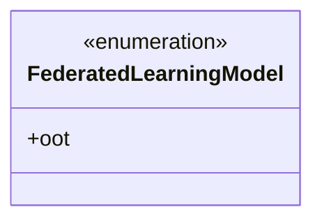
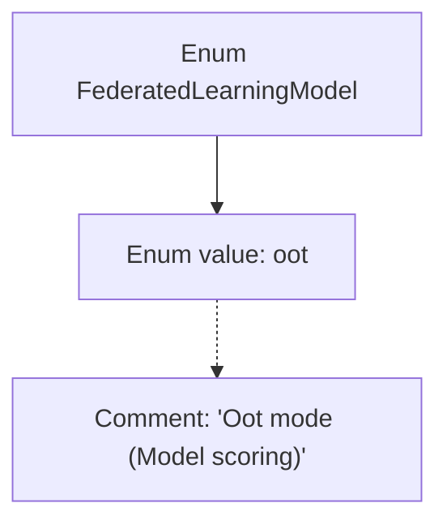

# Basic Information

|      |      |
|------|------|
| Name | FederatedLearningModel |
| Language | .java |
| Code Path | WeFe/common/java/common-wefe/src/main/java/com/welab/wefe/common/wefe/enums/FederatedLearningModel.java |
| Package Name | com.welab.wefe.common.wefe.enums |
| Dependencies | [] |
| Brief Description | The enumeration of federated learning models includes the OOT mode (model scoring). |

# Description

The content defines a public enumeration type named `FederatedLearningModel`, which includes an enumeration value `oot`. The comment for `oot` indicates its purpose as "Model scoring." The enumeration is used to represent specific modes of a federated learning model, with only one mode option included here. The entire definition is concise and directly relates to the model scoring functionality in federated learning scenarios.

# Class Summary

| Name   | Type  | Description |
|-------|------|-------------|
| FederatedLearningModel | enum | The enumeration of federated learning models includes the OOT mode (model scoring). |

## Class FederatedLearningModel

|      |      |
|------|------|
| Access Modifier | public |
| Type | enum |
| Name | FederatedLearningModel |
| Description | The enumeration of federated learning models includes the OOT mode (model scoring). |

### UML Class Diagram

This class diagram illustrates a simple enumeration type FederatedLearningModel, which currently contains only one enum value 'oot'. As an enumeration type, it is marked with <<enumeration>>, indicating this is a fixed set of values. 'oot' is the sole public member of this enumeration, representing the OOT (Out of Time) mode in federated learning models, primarily used for model scoring scenarios. This design pattern is commonly employed to define limited, predefined option sets within a system.

### Internal Method Call Graph

This flowchart illustrates the structure of the FederatedLearningModel enum, which includes an enum value named "oot" accompanied by a comment explaining its purpose as "Oot mode (Model scoring)". The concise structure clearly demonstrates the relationship between the enum definition and its documentation, suitable for representing the model scoring mode in federated learning.

### Field List

| Name  | Type  | Description |
|-------|-------|------|

### Method List

| Name  | Type  | Description |
|-------|-------|------|

