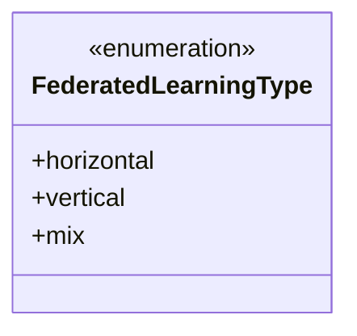
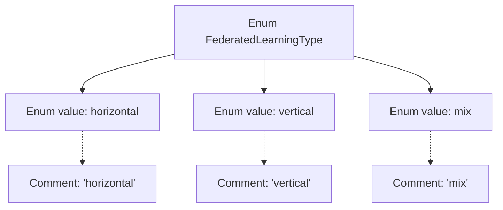

# Basic Information

|      |      |
|------|------|
| Name | FederatedLearningType |
| Language | .java |
| Code Path | WeFe/common/java/common-wefe/src/main/java/com/welab/wefe/common/wefe/enums/FederatedLearningType.java |
| Package Name | com.welab.wefe.common.wefe.enums |
| Dependencies | [] |
| Brief Description | The enumeration FederatedLearningType defines three types of federated learning: horizontal, vertical, and mix. |

# Description

The code defines an enumeration type named `FederatedLearningType`, which includes three enumeration values: `horizontal` (horizontal federated learning), `vertical` (vertical federated learning), and `mix` (hybrid federated learning). Each enumeration value has corresponding comments explaining its meaning. This enumeration is used to represent different types of federated learning approaches.

# Class Summary

| Name   | Type  | Description |
|-------|------|-------------|
| FederatedLearningType | enum | The enumeration defines three types of federated learning: horizontal, vertical, and hybrid. |

## Class FederatedLearningType

|      |      |
|------|------|
| Access Modifier | public |
| Type | enum |
| Name | FederatedLearningType |
| Description | The enumeration defines three types of federated learning: horizontal, vertical, and hybrid. |

### UML Class Diagram

This code defines an enumeration type named `FederatedLearningType`, which includes three enum constants: `horizontal` (horizontal federated learning), `vertical` (vertical federated learning), and `mix` (hybrid federated learning). Enumeration types are typically used to represent a fixed set of constant values, here employed to identify different types of federated learning approaches. As an enumeration type, all members are public by default and do not require explicit access modifiers.

### Internal Method Call Graph

This flowchart illustrates the structure of the FederatedLearningType enum, containing three enum values (horizontal, vertical, mix) along with their corresponding comment annotations. The enum, as a special class type, presents hierarchical relationships through graph TD orientation, with the main node connected to each enum value while comments are associated via dashed arrows. The diagram clearly demonstrates the definition approach and documentation annotation specifications for enums, suitable for representing the three classification types of federated learning.

### Field List

| Name  | Type  | Description |
|-------|-------|------|

### Method List

| Name  | Type  | Description |
|-------|-------|------|

