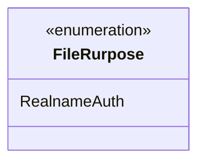
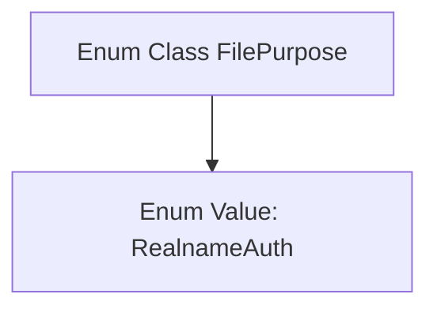

# Basic Information

|      |      |
|------|------|
| Name | FileRurpose |
| Language | .java |
| Code Path | WeFe/common/java/common-wefe/src/main/java/com/welab/wefe/common/wefe/enums/FileRurpose.java |
| Package Name | com.welab.wefe.common.wefe.enums |
| Dependencies | [] |
| Brief Description | The enumeration type FilePurpose defines a value RealnameAuth, which is used for real-name authentication scenarios. |

# Description

The content defines a public enumeration type named `FilePurpose`, which includes an enumeration value `RealnameAuth`. The enumeration is used to indicate the purpose of a file, currently supporting only real-name authentication as its sole purpose. The structure is concise and clear, without containing other members or complex logic.

# Class Summary

| Name   | Type  | Description |
|-------|------|-------------|
| FileRurpose | enum | The enumeration type FilePurpose defines a value RealnameAuth, which is used for real-name authentication scenarios. |

## Class FileRurpose

|      |      |
|------|------|
| Access Modifier | public |
| Type | enum |
| Name | FileRurpose |
| Description | The enumeration type FilePurpose defines a value RealnameAuth, which is used for real-name authentication scenarios. |

### UML Class Diagram

This code defines an enumeration type named `FileRurpose`, currently containing only one enumeration constant `RealnameAuth`. In class diagrams, enumerations are marked with `<<enumeration>>`, and their internal enumeration values are listed. This enumeration may be used to represent types of file purposes, such as real-name authentication scenarios. Since enumeration types are special classes, their structure must be explicitly labeled as an enumeration when displayed in class diagrams.

### Internal Method Call Graph

This code defines an enum class named `FilePurpose`, which includes an enum value `RealnameAuth`. Enum classes are typically used to represent a fixed set of constants, and here it may be used to identify the type of file purpose. The flowchart illustrates a simple hierarchical relationship between the class and its single enum value, suitable for scenarios requiring strict constraints on file purposes.

### Field List

| Name  | Type  | Description |
|-------|-------|------|

### Method List

| Name  | Type  | Description |
|-------|-------|------|

