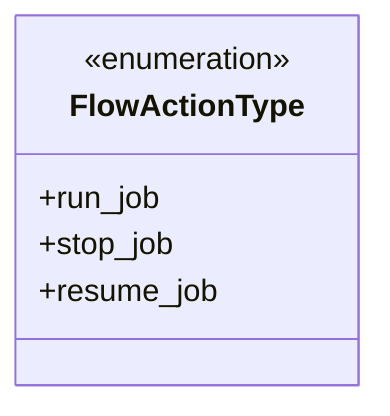
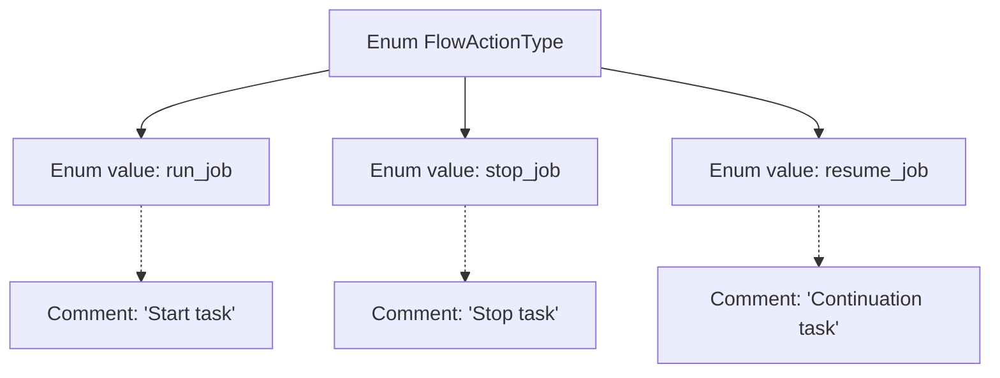

# Basic Information

|      |      |
|------|------|
| Name | FlowActionType |
| Language | .java |
| Code Path | WeFe/common/java/common-wefe/src/main/java/com/welab/wefe/common/wefe/enums/FlowActionType.java |
| Package Name | com.welab.wefe.common.wefe.enums |
| Dependencies | [] |
| Brief Description | The FlowActionType enumeration defines three task operations: run_job to start a task, stop_job to stop a task, and resume_job to resume a task. |

# Description

The content defines an enumeration type named FlowActionType, which includes three enumeration values: run_job indicates starting a task, stop_job indicates stopping a task, and resume_job indicates resuming a task. Each enumeration value has corresponding comments explaining its functionality.

# Class Summary

| Name   | Type  | Description |
|-------|------|-------------|
| FlowActionType | enum | The FlowActionType enumeration defines three task operations: run_job to start a task, stop_job to stop a task, and resume_job to resume a task. |

## Class FlowActionType

|      |      |
|------|------|
| Access Modifier | public |
| Type | enum |
| Name | FlowActionType |
| Description | The FlowActionType enumeration defines three task operations: run_job to start a task, stop_job to stop a task, and resume_job to resume a task. |

### UML Class Diagram

This code defines an enumeration type named `FlowActionType`, which includes three enum constants: `run_job` represents starting a task, `stop_job` represents stopping a task, and `resume_job` represents resuming a task. Enumeration types are used to represent a fixed set of constant values, often employed in scenarios like state management or option control. This enumeration clearly defines three basic operation types that may be triggered in a workflow, providing the system with type-safe operation identifiers.

### Internal Method Call Graph

This flowchart illustrates the structure of the FlowActionType enum, which includes three enum values: run_job (start task), stop_job (stop task), and resume_job (continue task). Each enum value is accompanied by corresponding English comments explaining its functionality. The diagram uses dashed lines to indicate the association between comments and enum values, collectively demonstrating the definition approach and documentation characteristics of the enum class.

### Field List

| Name  | Type  | Description |
|-------|-------|------|

### Method List

| Name  | Type  | Description |
|-------|-------|------|

