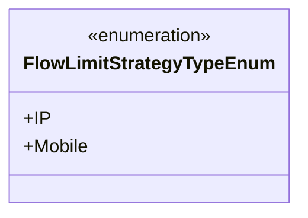
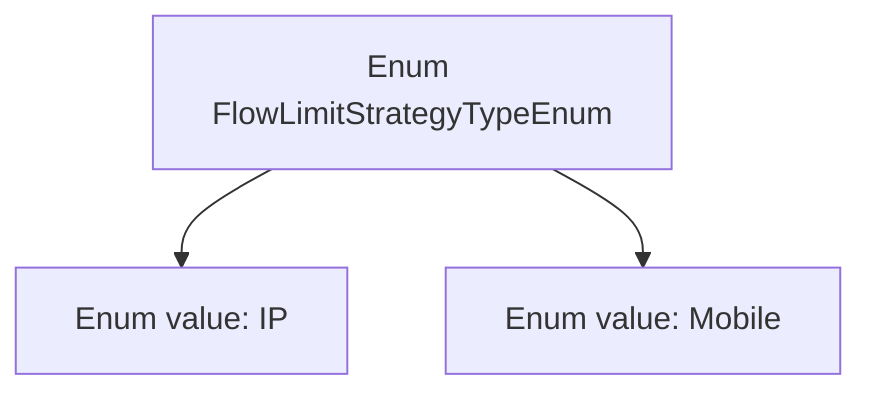

# Basic Information

|      |      |
|------|------|
| Name | FlowLimitStrategyTypeEnum |
| Language | .java |
| Code Path | WeFe/common/java/common-wefe/src/main/java/com/welab/wefe/common/wefe/enums/FlowLimitStrategyTypeEnum.java |
| Package Name | com.welab.wefe.common.wefe.enums |
| Dependencies | [] |
| Brief Description | The FlowLimitStrategyTypeEnum enumeration defines two types of flow limiting strategies: IP and Mobile. |

# Description

The content defines a public enumeration type named FlowLimitStrategyTypeEnum, which includes two enumeration constants: IP and Mobile. This enumeration may be used to represent the type of flow restriction strategy, where IP stands for IP address-based restrictions and Mobile represents mobile device-based restrictions. The enumeration structure is concise, containing only these two options without any additional attributes or methods.

# Class Summary

| Name   | Type  | Description |
|-------|------|-------------|
| FlowLimitStrategyTypeEnum | enum | The enumeration class defines two types of flow control strategies: IP and Mobile. |

## Class FlowLimitStrategyTypeEnum

|      |      |
|------|------|
| Access Modifier | public |
| Type | enum |
| Name | FlowLimitStrategyTypeEnum |
| Description | The enumeration class defines two types of flow control strategies: IP and Mobile. |

### UML Class Diagram

This code defines an enumeration type named FlowLimitStrategyTypeEnum, containing two enumeration constants: IP and Mobile. Enumeration types are typically used to represent a fixed set of constant values, which in this case likely identify the types of flow restriction strategies (IP-based or mobile number-based). The class diagram clearly illustrates the structure of the enumeration, using the <<enumeration>> stereotype to indicate it's an enumeration class, and lists all its public enumeration values.

### Internal Method Call Graph

This code defines an enum type named FlowLimitStrategyTypeEnum, which includes two enum values: IP and Mobile. This enum may be used to represent types of flow restriction strategies, where IP stands for an IP address-based restriction strategy, and Mobile represents a mobile device-based restriction strategy. The enum type succinctly defines the available strategy options, ensuring type safety and preventing invalid inputs.

### Field List

| Name  | Type  | Description |
|-------|-------|------|

### Method List

| Name  | Type  | Description |
|-------|-------|------|

