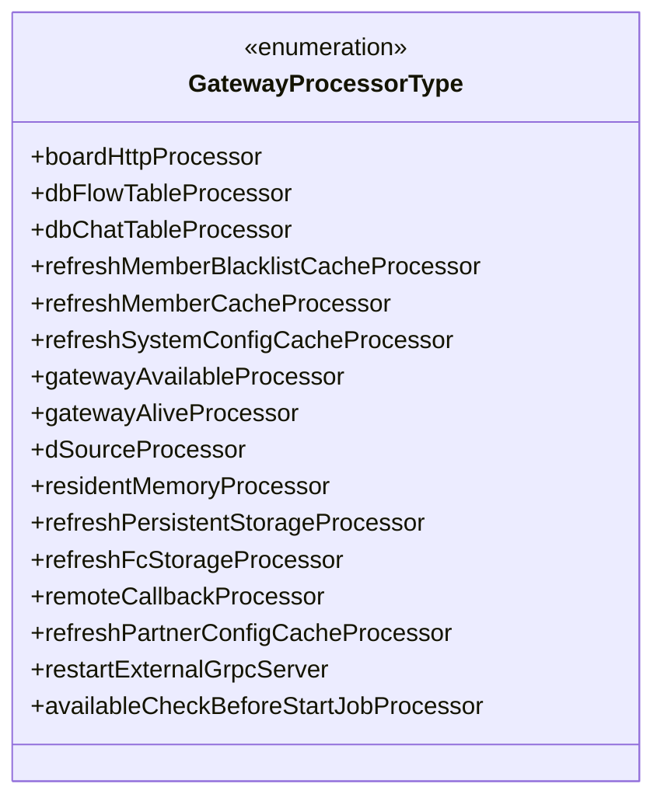

# Basic Information

|      |      |
|------|------|
| Name | GatewayProcessorType |
| Language | .java |
| Code Path | WeFe/common/java/common-wefe/src/main/java/com/welab/wefe/common/wefe/enums/GatewayProcessorType.java |
| Package Name | com.welab.wefe.common.wefe.enums |
| Dependencies | [] |
| Brief Description | The `GatewayProcessorType` enumeration defines multiple gateway processor types, including key functional modules such as HTTP push, database storage, cache refresh, gateway inspection, and external service management. |

# Description

This enumeration type defines various gateway processor types, covering functionalities such as message processing, data storage, cache refresh, and gateway status checks. Specifically, it includes the HTTP push to dashboard message processor, MySQL stream table and chat table storage processors, member blacklist and system configuration cache refresh processors, gateway availability and liveness status check processors, data source processor, resident memory processor, persistent storage and FC storage refresh processors, remote callback processor, partner configuration cache refresh processor, external gRPC service restart processor, and pre-task launch availability check processor. These processor types comprehensively address the core business requirements of the gateway system.

# Class Summary

| Name   | Type  | Description |
|-------|------|-------------|
| GatewayProcessorType | enum | The GatewayProcessorType enumeration defines various gateway processor types, including HTTP push, database storage, cache refresh, gateway check, etc. |

## Class GatewayProcessorType

|      |      |
|------|------|
| Access Modifier | public |
| Type | enum |
| Name | GatewayProcessorType |
| Description | The GatewayProcessorType enumeration defines various gateway processor types, including HTTP push, database storage, cache refresh, gateway check, etc. |

### UML Class Diagram

This code defines an enumeration type named GatewayProcessorType, which includes 15 distinct processor types corresponding to specific functional modules in the gateway system. These processors cover core functionalities such as message pushing, database operations, cache refreshing, gateway status checks, storage management, and remote callbacks, forming a complete set of processing capabilities for the gateway system. The enumeration values, through clear naming and annotations, indicate their respective purposes—for example, `boardHttpProcessor` handles HTTP push messages, and `dbFlowTableProcessor` manages MySQL flow table storage—embodying the modular design philosophy of the gateway system's architecture.

### Internal Method Call Graph

```mermaid
graph TD
    A["Enum Class GatewayProcessorType"]
    B["Enum Value: boardHttpProcessor"]
    C["Enum Value: dbFlowTableProcessor"]
    D["Enum Value: dbChatTableProcessor"]
    E["Enum Value: refreshMemberBlacklistCacheProcessor"]
    F["Enum Value: refreshMemberCacheProcessor"]
    G["Enum Value: refreshSystemConfigCacheProcessor"]
    H["Enum Value: gatewayAvailableProcessor"]
    I["Enum Value: gatewayAliveProcessor"]
    J["Enum Value: dSourceProcessor"]
    K["Enum Value: residentMemoryProcessor"]
    L["Enum Value: refreshPersistentStorageProcessor"]
    M["Enum Value: refreshFcStorageProcessor"]
    N["Enum Value: remoteCallbackProcessor"]
    O["Enum Value: refreshPartnerConfigCacheProcessor"]
    P["Enum Value: restartExternalGrpcServer"]
    Q["Enum Value: availableCheckBeforeStartJobProcessor"]

    A --> B
    A --> C
    A --> D
    A --> E
    A --> F
    A --> G
    A --> H
    A --> I
    A --> J
    A --> K
    A --> L
    A --> M
    A --> N
    A --> O
    A --> P
    A --> Q
```

This flowchart illustrates the complete structure of the GatewayProcessorType enum class, containing 15 enum values with distinct business meanings. These enum values correspond to different gateway processor types, including HTTP push, database storage, cache refresh, gateway status check, remote callback, and other processor types. Each enum value is clearly annotated to describe its specific functional purpose, forming a comprehensive classification system for gateway processing types.

### Field List

| Name  | Type  | Description |
|-------|-------|------|

### Method List

| Name  | Type  | Description |
|-------|-------|------|

