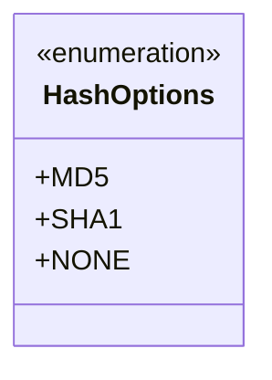
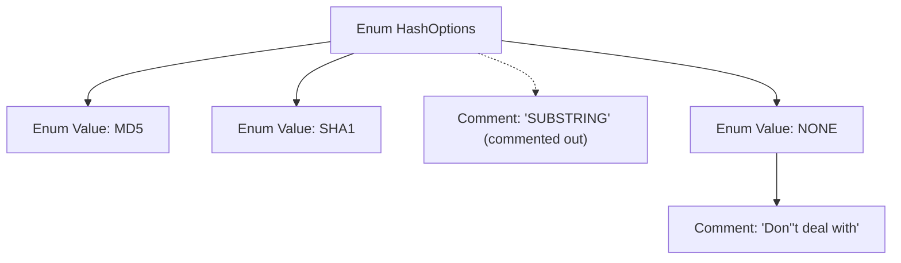

# Basic Information

|      |      |
|------|------|
| Name | HashOptions |
| Language | .java |
| Code Path | WeFe/common/java/common-wefe/src/main/java/com/welab/wefe/common/wefe/enums/HashOptions.java |
| Package Name | com.welab.wefe.common.wefe.enums |
| Dependencies | [] |
| Brief Description | Hash algorithm options enumeration: MD5, SHA1, NONE (no processing). |

# Description

The content defines an enumeration type named HashOptions, which includes three options: MD5, SHA1, and NONE. Among them, MD5 and SHA1 are two different hash algorithm options, while NONE indicates no hash processing will be performed. The comments reveal that there might have originally been a SUBSTRING option, but it is currently commented out and no longer in use. Additionally, the NONE option comes with an explanatory note stating that no processing will occur when this option is selected. The entire enumeration structure is concise and clear, designed to provide choices for hash processing methods.

# Class Summary

| Name   | Type  | Description |
|-------|------|-------------|
| HashOptions | enum | The hash option enumeration includes three types: MD5, SHA1, and NONE, used to specify the hashing method. |

## Class HashOptions

|      |      |
|------|------|
| Access Modifier | public |
| Type | enum |
| Name | HashOptions |
| Description | The hash option enumeration includes three types: MD5, SHA1, and NONE, used to specify the hashing method. |

### UML Class Diagram

This code defines an enumeration type named HashOptions, which includes three enumeration constants: MD5, SHA1, and NONE. Here, MD5 and SHA1 represent two hash algorithm options, while NONE indicates no hash processing. The SUBSTRING option mentioned in the comments has been commented out, suggesting it may have been deprecated or temporarily disabled. Enumeration types are typically used to represent a fixed set of constant values, and in this case, they are used to provide optional hash processing methods.

### Internal Method Call Graph

This code defines an enum type named HashOptions, containing three valid enum values (MD5, SHA1, NONE) and a commented-out SUBSTRING value. The NONE enum value is accompanied by a descriptive comment "Don't deal with", indicating that this option represents no processing. The flowchart clearly illustrates the constituent elements of the enum structure and their relationships, including the commented-out option that still holds reference value.

### Field List

| Name  | Type  | Description |
|-------|-------|------|

### Method List

| Name  | Type  | Description |
|-------|-------|------|

