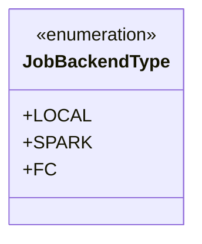
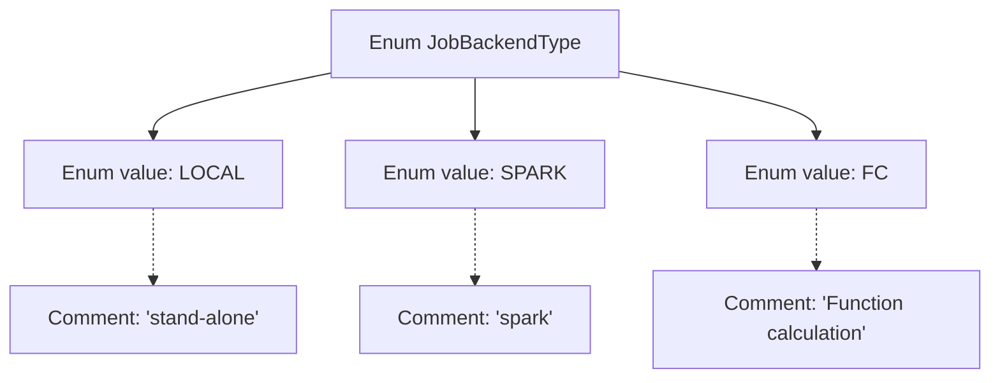

# Basic Information

|      |      |
|------|------|
| Name | JobBackendType |
| Language | .java |
| Code Path | WeFe/common/java/common-wefe/src/main/java/com/welab/wefe/common/wefe/enums/JobBackendType.java |
| Package Name | com.welab.wefe.common.wefe.enums |
| Dependencies | [] |
| Brief Description | The JobBackendType enumeration defines three types of job backends: the standalone local mode LOCAL, the Spark computing framework SPARK, and the function computing FC. |

# Description

The code defines an enumeration type named JobBackendType, which includes three enum values: LOCAL represents standalone execution mode, SPARK represents execution mode based on the Spark framework, and FC represents execution mode based on function computing. Each enum value has corresponding comments explaining its purpose.

# Class Summary

| Name   | Type  | Description |
|-------|------|-------------|
| JobBackendType | enum | The JobBackendType enum defines three types of job backends: LOCAL (standalone execution), SPARK (Spark engine), and FC (Function Compute). |

## Class JobBackendType

|      |      |
|------|------|
| Access Modifier | public |
| Type | enum |
| Name | JobBackendType |
| Description | The JobBackendType enum defines three types of job backends: LOCAL (standalone execution), SPARK (Spark engine), and FC (Function Compute). |

### UML Class Diagram

This code defines an enumeration type named JobBackendType, which includes three enumeration constants: LOCAL (indicating standalone execution mode), SPARK (representing the Spark computing engine), and FC (denoting function computation). Enumeration types are used to represent a fixed set of constant values, here primarily employed to identify the backend type for job execution. Each enumeration constant is accompanied by explanatory comments describing its purpose. This design is commonly used in system configuration or mode selection scenarios to ensure type safety and prevent invalid parameters.

### Internal Method Call Graph

This code defines an enumeration type named JobBackendType, which includes three enum values: LOCAL, SPARK, and FC, corresponding to different backend job types. Each enum value has an associated comment explaining its purpose: LOCAL indicates standalone execution mode, SPARK represents running on the Spark framework, and FC denotes function calculation mode. This enumeration is primarily used to identify and distinguish between different types of backend job execution environments.

### Field List

| Name  | Type  | Description |
|-------|-------|------|

### Method List

| Name  | Type  | Description |
|-------|-------|------|

