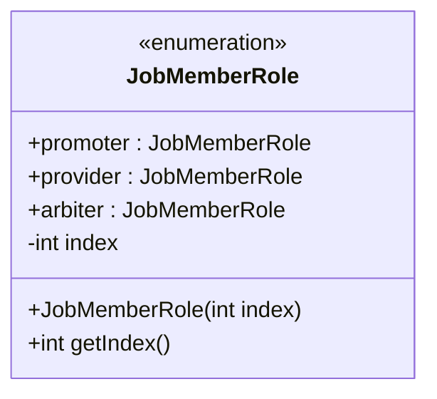
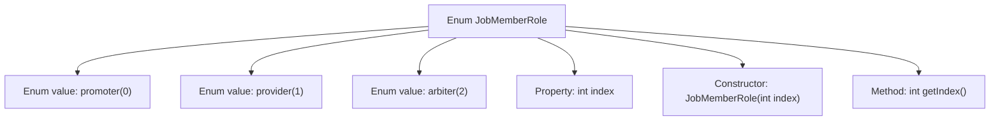

# Basic Information

|      |      |
|------|------|
| Name | JobMemberRole |
| Language | .java |
| Code Path | WeFe/common/java/common-wefe/src/main/java/com/welab/wefe/common/wefe/enums/JobMemberRole.java |
| Package Name | com.welab.wefe.common.wefe.enums |
| Dependencies | [] |
| Brief Description | The enumeration JobMemberRole defines the roles of task members: promoter, provider, and arbiter, each with a corresponding index number. |

# Description

The content defines an enumeration type named JobMemberRole, which includes three roles: promoter (task initiator, index 0), provider (task collaborator, index 1), and arbiter (arbitrator, index 2). Each enumeration value has an integer index property representing the sorting order and is initialized via a constructor. The enumeration provides a getIndex method to retrieve the index value. This enumeration is used to identify different role types of task members and their order.

# Class Summary

| Name   | Type  | Description |
|-------|------|-------------|
| JobMemberRole | enum | The JobMemberRole enumeration defines the roles of task members: promoter, provider, and arbiter, each with a corresponding index number. |

## Class JobMemberRole

|      |      |
|------|------|
| Access Modifier | public |
| Type | enum |
| Name | JobMemberRole |
| Description | The JobMemberRole enumeration defines the roles of task members: promoter, provider, and arbiter, each with a corresponding index number. |

### UML Class Diagram

This code defines an enumeration type JobMemberRole, which includes three enum constants: promoter, provider, and arbiter, representing the job initiator, job collaborator, and arbitrator respectively. Each enum constant has an associated integer index value initialized via the constructor, and provides a getIndex() method to retrieve this value. The enumeration type is used to represent a fixed set of constants, here employed to distinguish different job member roles and their ordinal positions.

### Internal Method Call Graph

This flowchart illustrates the structure of the JobMemberRole enum, which includes three enum values (promoter, provider, arbiter) along with their corresponding index values. The enum stores the sequence number via a private property 'index', initializes this property through its constructor, and provides external access via the getIndex() method. It comprehensively depicts the hierarchy of enum definition, property initialization, and method invocation, clearly presenting the core components of the enum class.

### Field List

| Name  | Type  | Description |
|-------|-------|------|

### Method List

| Name  | Type  | Description |
|-------|-------|------|

