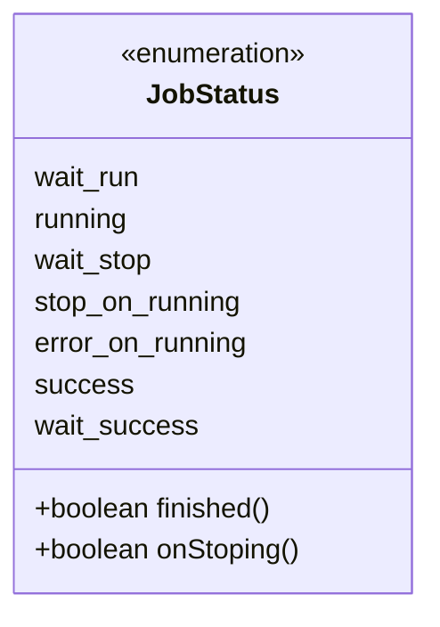
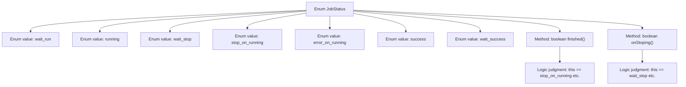

# Basic Information

|      |      |
|------|------|
| Name | JobStatus |
| Language | .java |
| Code Path | WeFe/common/java/common-wefe/src/main/java/com/welab/wefe/common/wefe/enums/JobStatus.java |
| Package Name | com.welab.wefe.common.wefe.enums |
| Dependencies | [] |
| Brief Description | The JobStatus enum defines task states: Waiting to Run, Running, Waiting to End, Manually Stopped, Abnormally Terminated, Success, Waiting for Success. Includes methods to check whether a task has ended or is in the process of stopping. |

# Description

The enumeration defines seven types of job statuses: Waiting to Run, Running, Waiting to End, Manually Stopped, Abnormal Execution, Successfully Ended, Waiting for Success. It includes two methods: `finished` determines whether the status is Stopped, Abnormal, or Success; `onStoping` determines whether the status is Waiting to End or Waiting for Success.

# Class Summary

| Name   | Type  | Description |
|-------|------|-------------|
| JobStatus | enum | The JobStatus enumeration defines task states: Waiting to Run, Running, Waiting to End, Manually Stopped, Abnormally Terminated, Success, Waiting for Success. It includes methods for checking task completion and stopped status. |

## Class JobStatus

|      |      |
|------|------|
| Access Modifier | public |
| Type | enum |
| Name | JobStatus |
| Description | The JobStatus enumeration defines task states: Waiting to Run, Running, Waiting to End, Manually Stopped, Abnormally Terminated, Success, Waiting for Success. It includes methods for checking task completion and stopped status. |

### UML Class Diagram

This code defines an enumeration type JobStatus, which represents different states of a task and their transition relationships. The enumeration includes 7 states: wait_run (waiting to run), running, wait_stop (waiting to stop), stop_on_running (manually stopped during execution), error_on_running (abnormal termination during execution), success, and wait_success (waiting for success). It provides two methods: finished() to determine whether the task has ended (including normal completion, manual stop, and abnormal termination), and onStoping() to determine whether the task is in the wait_stop or wait_success state. This enumeration clearly describes the various stages of the task lifecycle and its termination conditions.

### Internal Method Call Graph

This flowchart illustrates the structure of the JobStatus enum, which includes 7 state values and 2 methods. The finished() method checks whether a task has ended (including normal completion, abnormal termination, and manual stopping), while the onStoping() method detects if it's in a wait-stop state. The enum clearly defines various states in the task lifecycle and their judgment logic through state values and methods, making it suitable for task status tracking and management scenarios.

### Field List

| Name  | Type  | Description |
|-------|-------|------|

### Method List

| Name  | Type  | Description |
|-------|-------|------|

