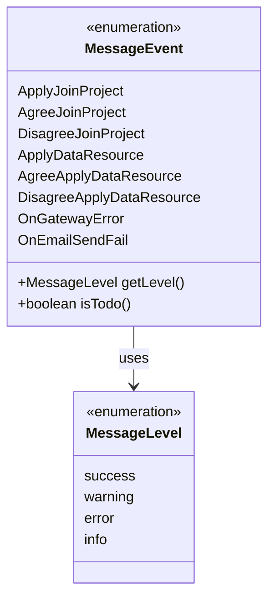
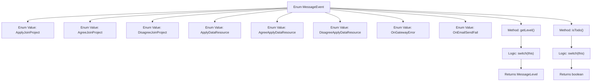

# Basic Information

|      |      |
|------|------|
| Name | MessageEvent |
| Language | .java |
| Code Path | WeFe/common/java/common-wefe/src/main/java/com/welab/wefe/common/wefe/enums/MessageEvent.java |
| Package Name | com.welab.wefe.common.wefe.enums |
| Dependencies | [] |
| Brief Description | Message event enumeration, including project joining, data resource application and processing results, gateway errors, and email sending failure events. Returns different levels and to-do statuses based on the event type. |

# Description

This enumeration defines various message event types, including project join invitations, acceptance or rejection of project participation, data resource requests and their processing results, gateway service errors, and email delivery failures. Each event type is associated with a message level (success, warning, error, or info) and returned via the getLevel method. Some events are marked as to-do items (e.g., request-type events) and determined by the isTodo method. The overall structure is clear and designed to categorize and handle message events across different business scenarios.

# Class Summary

| Name   | Type  | Description |
|-------|------|-------------|
| MessageEvent | enum | The enumeration MessageEvent defines message event types, including project invitations, data requests, and system errors, with level determination and pending status markers. |

## Class MessageEvent

|      |      |
|------|------|
| Access Modifier | public |
| Type | enum |
| Name | MessageEvent |
| Description | The enumeration MessageEvent defines message event types, including project invitations, data requests, and system errors, with level determination and pending status markers. |

### UML Class Diagram

This code defines an enumeration class MessageEvent, representing different types of message events, including project join applications, data resource applications, and related processing results. The enumeration provides the getLevel() method to return the corresponding message level (MessageLevel enumeration) based on the event type, and the isTodo() method to determine whether processing is required. The class diagram clearly illustrates the dependency relationship between the MessageEvent enumeration and the MessageLevel enumeration, reflecting the logical structure of message event classification and level determination.

### Internal Method Call Graph

This code defines a MessageEvent enum containing 8 message event types and 2 methods. The getLevel() method returns the corresponding message level (success/warning/error/info) based on the event type, while the isTodo() method determines whether the event requires processing (true/false). The flowchart clearly illustrates the enum structure and method logic branches, where both getLevel() and isTodo() implement conditional judgments via switch statements, returning a MessageLevel enum and boolean value respectively.

### Field List

| Name  | Type  | Description |
|-------|-------|------|

### Method List

| Name  | Type  | Description |
|-------|-------|------|

