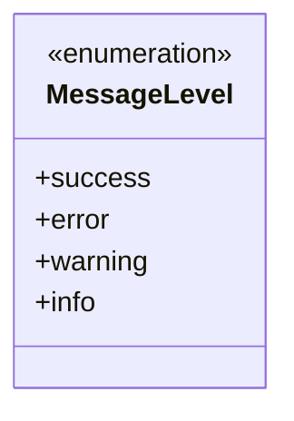
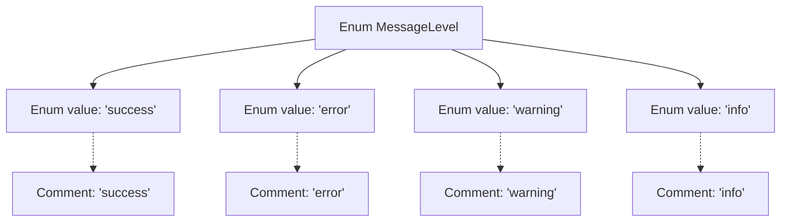

# Basic Information

|      |      |
|------|------|
| Name | MessageLevel |
| Language | .java |
| Code Path | WeFe/common/java/common-wefe/src/main/java/com/welab/wefe/common/wefe/enums/MessageLevel.java |
| Package Name | com.welab.wefe.common.wefe.enums |
| Dependencies | [] |
| Brief Description | Define message-level enumerations, including four types: success, error, warning, and information. |

# Description

The content defines an enumeration type named MessageLevel, containing four enumeration values: success indicates a successful state, error indicates an error state, warning indicates a warning state, and info indicates an informational state. Each enumeration value has corresponding comments explaining its purpose. This enumeration is used to represent different levels or types of messages.

# Class Summary

| Name   | Type  | Description |
|-------|------|-------------|
| MessageLevel | enum | Defined an enumeration type at the message level, including four statuses: success, error, warning, and information. |

## Class MessageLevel

|      |      |
|------|------|
| Access Modifier | public |
| Type | enum |
| Name | MessageLevel |
| Description | Defined an enumeration type at the message level, including four statuses: success, error, warning, and information. |

### UML Class Diagram

This code defines an enumeration type named MessageLevel, which includes four enumeration constants: success, error, warning, and info. Each enumeration constant is accompanied by corresponding comments explaining its purpose. Enumeration types are typically used to represent a fixed set of constant values, here employed to denote different levels of messages. This enumeration can be utilized to categorize or label messages of varying importance, such as distinguishing different types of notifications in logging systems or user interfaces.

### Internal Method Call Graph

This flowchart illustrates the structure of the MessageLevel enum, which includes four enum values (success, error, warning, info) along with their corresponding documentation comments. Each enum value is connected via dashed lines to its documentation comment, clearly presenting the relationship between the enum definition and its documentation. This structure is commonly used to define types with fixed option sets, suitable for status marking or classification scenarios.

### Field List

| Name  | Type  | Description |
|-------|-------|------|

### Method List

| Name  | Type  | Description |
|-------|-------|------|

