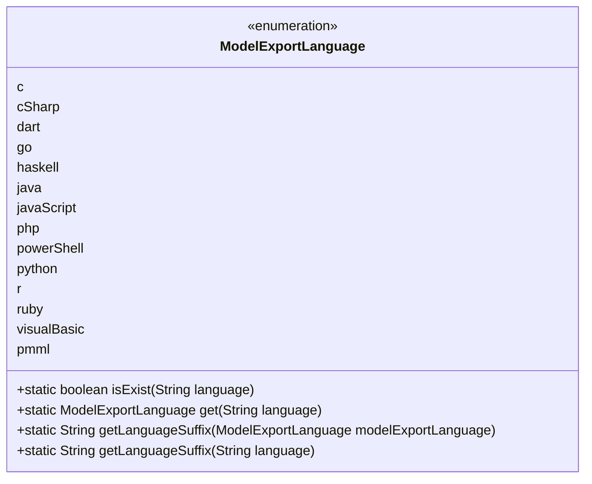
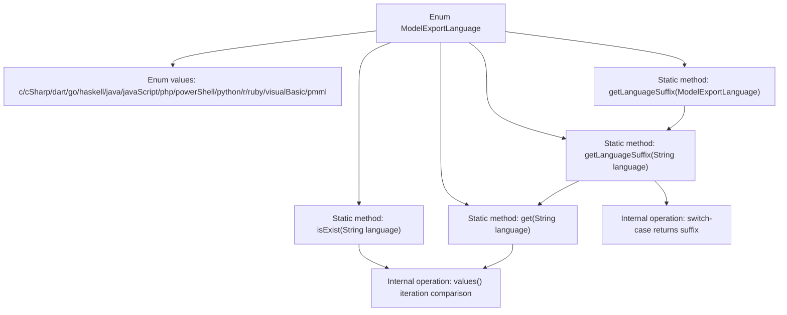

# Basic Information

|      |      |
|------|------|
| Name | ModelExportLanguage |
| Language | .java |
| Code Path | WeFe/common/java/common-wefe/src/main/java/com/welab/wefe/common/wefe/enums/ModelExportLanguage.java |
| Package Name | com.welab.wefe.common.wefe.enums |
| Dependencies | [] |
| Brief Description | The enumeration class `ModelExportLanguage` defines 14 programming languages and PMML, providing methods to check language existence, retrieve enumeration instances, and obtain corresponding file extensions. |

# Description

The enumeration class defines multiple model export language types, including 14 languages such as c, cSharp, and dart. It provides three static methods: `isExist` to check if a language exists, `get` to retrieve the corresponding enumeration instance, and `getLanguageSuffix` to obtain the language suffix. The suffix mapping rules are clearly defined, such as "c" corresponding to "c", "python" corresponding to "py", etc. All methods handle null cases, returning an empty string or null.

# Class Summary

| Name   | Type  | Description |
|-------|------|-------------|
| ModelExportLanguage | enum | The enumeration class ModelExportLanguage defines multiple programming languages, providing methods to check existence, retrieve instances, and obtain file extensions. |

## Class ModelExportLanguage

|      |      |
|------|------|
| Access Modifier | public |
| Type | enum |
| Name | ModelExportLanguage |
| Description | The enumeration class ModelExportLanguage defines multiple programming languages, providing methods to check existence, retrieve instances, and obtain file extensions. |

### UML Class Diagram

This code defines an enumeration class `ModelExportLanguage` to represent export formats for different programming languages. The enumeration includes 14 language types and provides 4 static methods: `isExist()` checks if a language exists, `get()` retrieves the corresponding enum instance, and `getLanguageSuffix()` obtains the language suffix (overloaded to accept either an enum instance or string input). The class diagram clearly displays the enum values and method access levels, with all methods being public static for direct invocation via the class name.

### Internal Method Call Graph

This flowchart illustrates the core structure of the ModelExportLanguage enum, which includes 14 programming language enum values and 4 key static methods. The isExist() and get() methods perform matching judgments by iterating through enum values, while getLanguageSuffix() implements suffix retrieval through dual method overloading, with the final version using a switch-case structure to return standard file extensions for each language. The entire design achieves three main functionalities: language type validation, enum instance retrieval, and file extension conversion.

### Field List

| Name  | Type  | Description |
|-------|-------|------|

### Method List

| Name  | Type  | Description |
|-------|-------|------|

