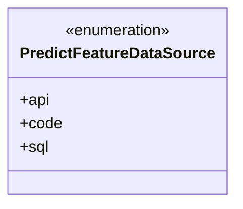
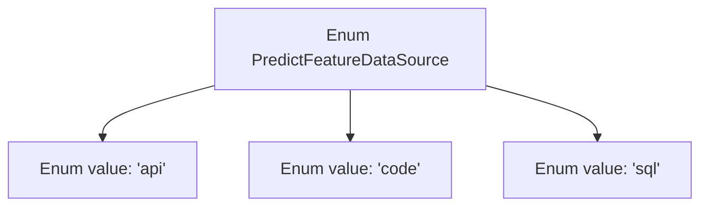

# Basic Information

|      |      |
|------|------|
| Name | PredictFeatureDataSource |
| Language | .java |
| Code Path | WeFe/common/java/common-wefe/src/main/java/com/welab/wefe/common/wefe/enums/PredictFeatureDataSource.java |
| Package Name | com.welab.wefe.common.wefe.enums |
| Dependencies | [] |
| Brief Description | The PredictFeatureDataSource enumeration defines three data sources: api, code, and sql. |

# Description

The content defines a public enumeration type named `PredictFeatureDataSource`, which includes three enumeration constants: `api`, `code`, and `sql`. Each constant is accompanied by a brief comment explaining its meaning, representing three types of data sources: API, code, and SQL, respectively. This enumeration may be used to identify the data source channels for predictive features.

# Class Summary

| Name   | Type  | Description |
|-------|------|-------------|
| PredictFeatureDataSource | enum | The enumeration PredictFeatureDataSource defines three types of data sources: api, code, and sql. |

## Class PredictFeatureDataSource

|      |      |
|------|------|
| Access Modifier | public |
| Type | enum |
| Name | PredictFeatureDataSource |
| Description | The enumeration PredictFeatureDataSource defines three types of data sources: api, code, and sql. |

### UML Class Diagram

This code defines an enumeration type named PredictFeatureDataSource, which contains three enumeration constants: api, code, and sql. The enumeration is used to represent different source types for predictive feature data, with each source having clear documentation comments explaining its meaning. As an enumeration class, it provides a type-safe collection of constants, making it suitable for scenarios where data sources need to be restricted. It effectively avoids the type safety issues that arise from using string or integer constants.

### Internal Method Call Graph

This flowchart illustrates the structure of the PredictFeatureDataSource enum, which contains three predefined constant values: api, code, and sql. The enum type is used to represent a fixed set of data source types, with each value corresponding to a different method of feature data acquisition. This design pattern ensures type safety and code readability, making it suitable for scenarios requiring strictly defined input ranges.

### Field List

| Name  | Type  | Description |
|-------|-------|------|

### Method List

| Name  | Type  | Description |
|-------|-------|------|

