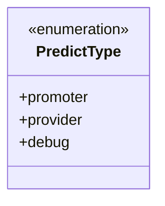
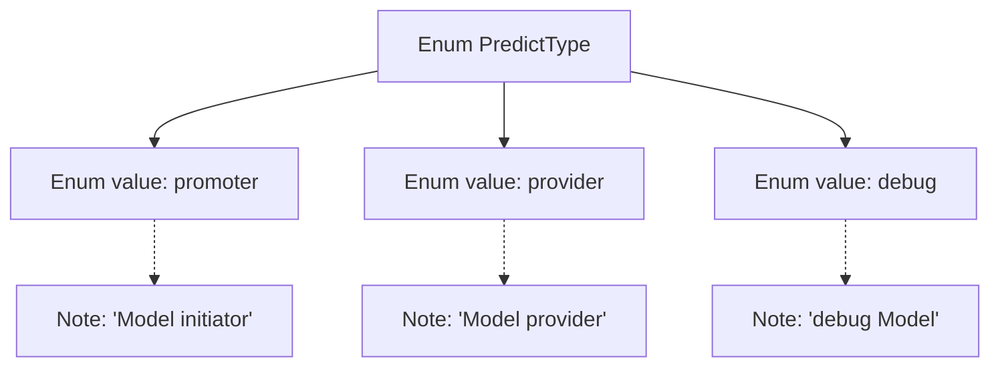

# Basic Information

|      |      |
|------|------|
| Name | PredictType |
| Language | .java |
| Code Path | WeFe/common/java/common-wefe/src/main/java/com/welab/wefe/common/wefe/enums/PredictType.java |
| Package Name | com.welab.wefe.common.wefe.enums |
| Dependencies | [] |
| Brief Description | The enumeration PredictType defines three types: promoter (model initiator), provider (model provider), and debug (debugging model). |

# Description

The content defines an enumeration type named `PredictType`, which includes three enumeration values: `promoter` represents the model initiator, `provider` represents the model provider, and `debug` represents the debugging model. Each enumeration value has corresponding comments explaining its purpose.

# Class Summary

| Name   | Type  | Description |
|-------|------|-------------|
| PredictType | enum | The PredictType enum defines three types: promoter, provider, and debug. |

## Class PredictType

|      |      |
|------|------|
| Access Modifier | public |
| Type | enum |
| Name | PredictType |
| Description | The PredictType enum defines three types: promoter, provider, and debug. |

### UML Class Diagram

This code defines an enumeration type named PredictType, containing three enum constants: promoter (model initiator), provider (model provider), and debug (debug model). An enumeration type is used to represent a fixed set of constant values, each with specific business meanings. This enumeration may be employed to distinguish between different types of prediction model participants or modes, serving an identification and classification role within the system. In the class diagram, the enumeration type is marked with <<enumeration>>, clearly illustrating its structure and available options.

### Internal Method Call Graph

This flowchart illustrates the structure of the PredictType enum, which contains three enum values (promoter, provider, debug) along with their corresponding descriptive notes. The promoter is annotated as "Model initiator", provider as "Model provider", and debug as "debug Model". The diagram clearly presents the relationship between the enum definition and its values, with dashed lines indicating the correspondence between notes and enum values.

### Field List

| Name  | Type  | Description |
|-------|-------|------|

### Method List

| Name  | Type  | Description |
|-------|-------|------|

