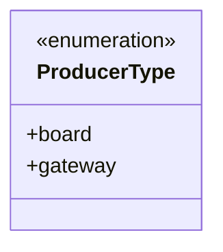
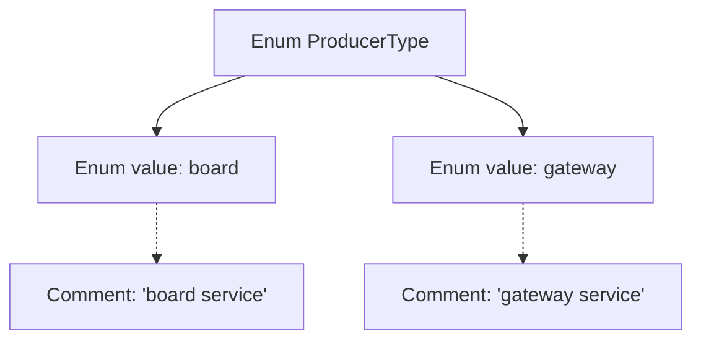

# Basic Information

|      |      |
|------|------|
| Name | ProducerType |
| Language | .java |
| Code Path | WeFe/common/java/common-wefe/src/main/java/com/welab/wefe/common/wefe/enums/ProducerType.java |
| Package Name | com.welab.wefe.common.wefe.enums |
| Dependencies | [] |
| Brief Description | The enumeration ProducerType defines two service types: board (panel service) and gateway (gateway service). |

# Description

The content defines a public enumeration type named ProducerType, which includes two enumeration constants: board and gateway. The board constant represents the board service, while the gateway constant represents the gateway service. Enumeration types are used to represent a fixed set of related constants, and here they are employed to identify different service types.

# Class Summary

| Name   | Type  | Description |
|-------|------|-------------|
| ProducerType | enum | The enumeration ProducerType defines two service types: board (panel service) and gateway (gateway service). |

## Class ProducerType

|      |      |
|------|------|
| Access Modifier | public |
| Type | enum |
| Name | ProducerType |
| Description | The enumeration ProducerType defines two service types: board (panel service) and gateway (gateway service). |

### UML Class Diagram

This code defines an enumeration type named `ProducerType`, containing two enum constants: `board` and `gateway`, representing "board service" and "gateway service" as two types of producers. In the class diagram, the enumeration type is marked with `<<enumeration>>`, and its members are listed as public attributes. This enumeration structure is simple and primarily used for classifying different service source types.

### Internal Method Call Graph

This flowchart illustrates the structure of the ProducerType enum, which includes two enum values: board and gateway, corresponding to board service and gateway service types respectively. The enum clearly identifies the business meaning of each value through comments, presenting a concise and well-organized structure suitable for scenarios requiring differentiation between producer types.

### Field List

| Name  | Type  | Description |
|-------|-------|------|

### Method List

| Name  | Type  | Description |
|-------|-------|------|

