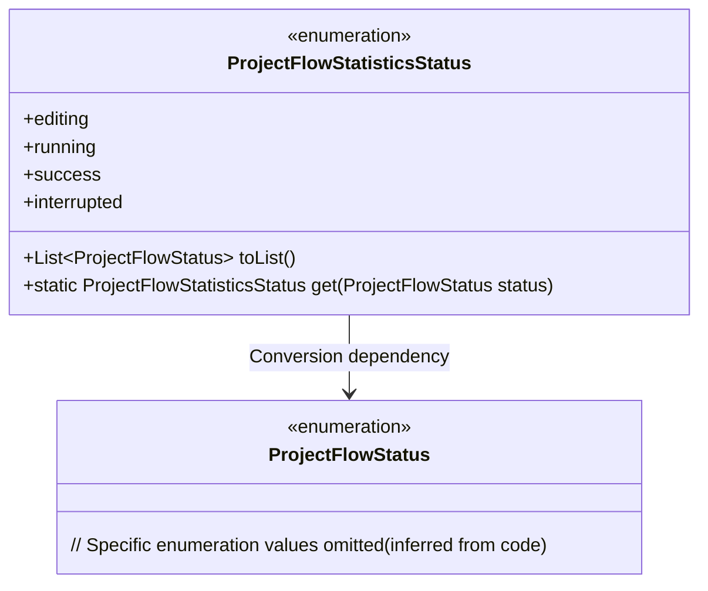
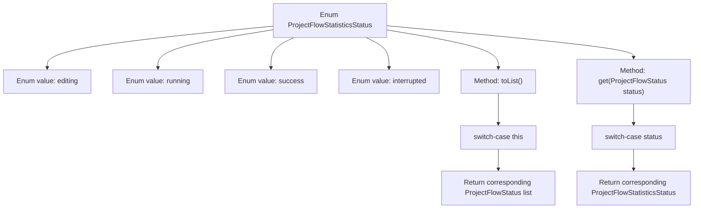

# Basic Information

|      |      |
|------|------|
| Name | ProjectFlowStatisticsStatus |
| Language | .java |
| Code Path | WeFe/common/java/common-wefe/src/main/java/com/welab/wefe/common/wefe/enums/ProjectFlowStatisticsStatus.java |
| Package Name | com.welab.wefe.common.wefe.enums |
| Dependencies | ['java.util.Arrays', 'java.util.List'] |
| Brief Description | The enumeration class defines the project flow statistics states, including four states: editing, running, success, and interrupted, and provides state transition methods. |

# Description

The code defines an enumeration class `ProjectFlowStatisticsStatus`, which includes four states: Editing, Running, Success, and Interrupted. It provides two methods: `toList` maps the current enumeration value to a list of `ProjectFlowStatus`, and `get` converts a `ProjectFlowStatus` to the corresponding `ProjectFlowStatisticsStatus` enumeration value. There are clear mapping relationships between the states, such as the Running state corresponding to four substates and the Interrupted state corresponding to two exception scenarios. A runtime exception is thrown if no matching enumeration is found.

# Class Summary

| Name   | Type  | Description |
|-------|------|-------------|
| ProjectFlowStatisticsStatus | enum | Enumeration class defines project flow statuses: Editing, Running, Success, Interrupted. Provides mutual conversion methods with project flow states. |

## Class ProjectFlowStatisticsStatus

|      |      |
|------|------|
| Access Modifier | public |
| Type | enum |
| Name | ProjectFlowStatisticsStatus |
| Description | Enumeration class defines project flow statuses: Editing, Running, Success, Interrupted. Provides mutual conversion methods with project flow states. |

### UML Class Diagram

The diagram illustrates a conversion relationship between an enumeration class `ProjectFlowStatisticsStatus` and another enumeration class `ProjectFlowStatus`. `ProjectFlowStatisticsStatus` contains 4 enumeration values and 2 core methods: `toList()` maps the current state to a list of `ProjectFlowStatus`, while the `get()` method implements reverse mapping. The arrow indicates that the former relies on the latter for state conversion, reflecting an aggregation relationship between workflow status statistics and basic states.

### Internal Method Call Graph

This flowchart illustrates the structure and core method logic of the ProjectFlowStatisticsStatus enum. The enum contains 4 state values (editing/running/success/interrupted) and 2 key methods: toList() maps the current enum to a ProjectFlowStatus list, while get() implements reverse mapping. Both methods use switch-case structures to handle different state branches, ultimately returning collections or enum instances of the corresponding type. The flowchart clearly presents the invocation relationships between enum definitions and methods.

### Field List

| Name  | Type  | Description |
|-------|-------|------|

### Method List

| Name  | Type  | Description |
|-------|-------|------|

