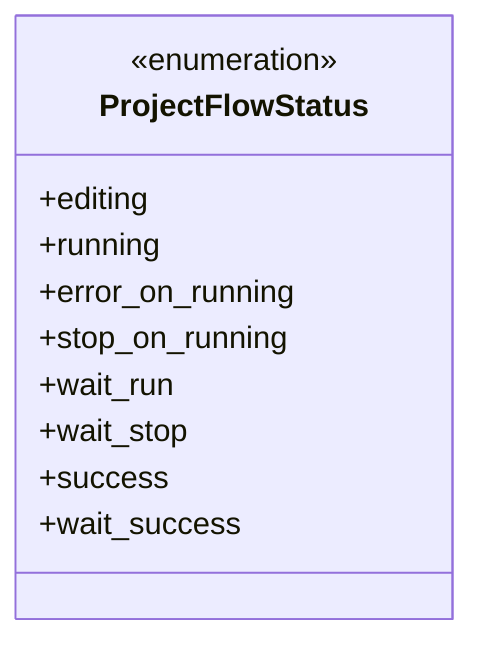
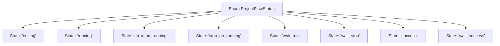

# Basic Information

|      |      |
|------|------|
| Name | ProjectFlowStatus |
| Language | .java |
| Code Path | WeFe/common/java/common-wefe/src/main/java/com/welab/wefe/common/wefe/enums/ProjectFlowStatus.java |
| Package Name | com.welab.wefe.common.wefe.enums |
| Dependencies | [] |
| Brief Description | Project process status enumeration: Editing, Running, Runtime Error, Manually Paused, Waiting to Run, Waiting to End, Success, Waiting for Success. |

# Description

This is an enumeration type named ProjectFlowStatus, which defines 8 states of the project flow: editing, running, error_on_running, stop_on_running, wait_run, wait_stop, success, and wait_success. Each state has corresponding comments explaining its meaning.

# Class Summary

| Name   | Type  | Description |
|-------|------|-------------|
| ProjectFlowStatus | enum | Project process status enumeration: Editing, Running, Runtime Error, Manually Paused, Waiting to Run, Waiting to End, Success, Waiting for Success. |

## Class ProjectFlowStatus

|      |      |
|------|------|
| Access Modifier | public |
| Type | enum |
| Name | ProjectFlowStatus |
| Description | Project process status enumeration: Editing, Running, Runtime Error, Manually Paused, Waiting to Run, Waiting to End, Success, Waiting for Success. |

### UML Class Diagram

This enumeration class defines 8 states of the project workflow, including editing (editing), running (running), runtime error (error_on_running), manual pause (stop_on_running), waiting to run (wait_run), waiting to stop (wait_stop), success (success), and waiting for success (wait_success). Each state has clear documentation comments explaining its meaning, comprehensively covering all possible states from the start to the end of the project workflow. The enumeration type is suitable for representing such a fixed set of states, ensuring type safety and ease of maintenance.

### Internal Method Call Graph

This flowchart illustrates all possible states of the ProjectFlowStatus enumeration. The enum defines 8 states of a project flow, including editing, running, error_on_running, manually stopped (stop_on_running), wait_run, wait_stop, success, and wait_success. Each state is connected to the enum class via arrows, clearly showing their hierarchical relationship.

### Field List

| Name  | Type  | Description |
|-------|-------|------|

### Method List

| Name  | Type  | Description |
|-------|-------|------|

