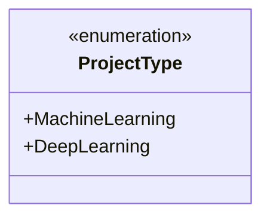
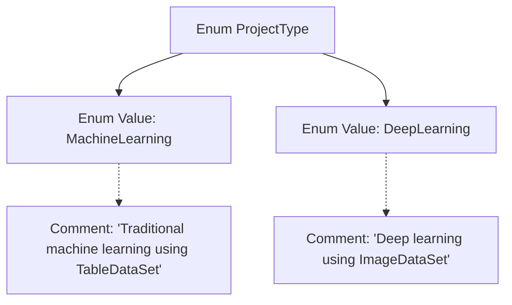

# Basic Information

|      |      |
|------|------|
| Name | ProjectType |
| Language | .java |
| Code Path | WeFe/common/java/common-wefe/src/main/java/com/welab/wefe/common/wefe/enums/ProjectType.java |
| Package Name | com.welab.wefe.common.wefe.enums |
| Dependencies | [] |
| Brief Description | The ProjectType enum defines two project types: MachineLearning (traditional machine learning, using TableDataSet) and DeepLearning (deep learning, using ImageDataSet). |

# Description

The content defines an enumeration type named ProjectType, which includes two enumeration values. MachineLearning represents the traditional machine learning project type using TableDataSet, while DeepLearning denotes the deep learning project type using ImageDataSet. Each enumeration value is accompanied by corresponding comments explaining its purpose and the associated dataset type.

# Class Summary

| Name   | Type  | Description |
|-------|------|-------------|
| ProjectType | enum | The ProjectType enum defines two project types: MachineLearning (traditional machine learning, using TableDataSet) and DeepLearning (deep learning, using ImageDataSet). |

## Class ProjectType

|      |      |
|------|------|
| Access Modifier | public |
| Type | enum |
| Name | ProjectType |
| Description | The ProjectType enum defines two project types: MachineLearning (traditional machine learning, using TableDataSet) and DeepLearning (deep learning, using ImageDataSet). |

### UML Class Diagram

This code defines an enumeration type named ProjectType, containing two enum constants: MachineLearning and DeepLearning. MachineLearning represents traditional machine learning project types using TableDataSet, while DeepLearning denotes deep learning project types utilizing ImageDataSet. The enumeration type is explicitly marked with the <<enumeration>> stereotype, and both enum constants are public members. This design concisely restricts the selectable range of project types, facilitating clear distinction between different project scenarios in the code.

### Internal Method Call Graph

This flowchart illustrates the structure of the ProjectType enum, which contains two enum values: MachineLearning and DeepLearning, each accompanied by corresponding descriptive comments. The MachineLearning comment specifies its use of TableDataSet for traditional machine learning, while the DeepLearning comment indicates its use of ImageDataSet for deep learning. This design clearly delineates the core data structures and application domains for different project types.

### Field List

| Name  | Type  | Description |
|-------|-------|------|

### Method List

| Name  | Type  | Description |
|-------|-------|------|

