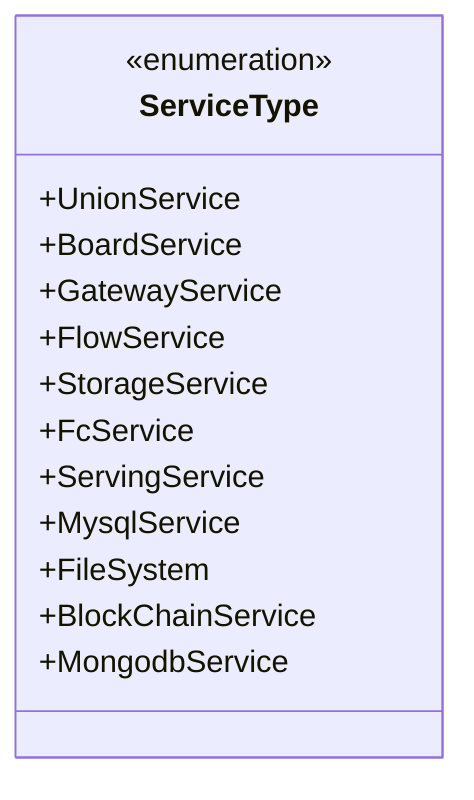
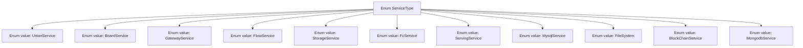

# Basic Information

|      |      |
|------|------|
| Name | ServiceType |
| Language | .java |
| Code Path | WeFe/common/java/common-wefe/src/main/java/com/welab/wefe/common/wefe/enums/ServiceType.java |
| Package Name | com.welab.wefe.common.wefe.enums |
| Dependencies | [] |
| Brief Description | The enumeration ServiceType defines 11 service types, including federation service, board service, gateway service, stream service, storage service, FC service, service service, MySQL service, file system, blockchain service, and MongoDB service. |

# Description

The content defines an enumeration type named ServiceType, which includes 11 service type constants: UnionService, BoardService, GatewayService, FlowService, StorageService, FcService, ServingService, MysqlService, FileSystem, BlockChainService, and MongodbService. Each constant represents a specific service type. The enumeration structure is concise and clear, with no additional explanatory comments.

# Class Summary

| Name   | Type  | Description |
|-------|------|-------------|
| ServiceType | enum | The enumeration ServiceType defines 11 types of services, including federated services, board services, gateway services, etc., covering categories such as storage, databases, and blockchain. |

## Class ServiceType

|      |      |
|------|------|
| Access Modifier | public |
| Type | enum |
| Name | ServiceType |
| Description | The enumeration ServiceType defines 11 types of services, including federated services, board services, gateway services, etc., covering categories such as storage, databases, and blockchain. |

### UML Class Diagram

This code defines an enumeration type named `ServiceType` containing 11 predefined constant values, each representing different types of services (such as Union Service, Board Service, Gateway Service, etc.). In the class diagram, the enumeration type is marked with `<<enumeration>>`, and all enumeration values are public static constants. This design is used to clearly distinguish between different service types within the system, facilitating type-safe programming and clear expression of business logic.

### Internal Method Call Graph

This flowchart illustrates the structure of the ServiceType enum class, which contains 11 predefined enum constants, each representing a specific service type. These enum values exist in parallel relationships, collectively forming the complete value set of the enum class. It is suitable for scenarios requiring explicit service type constraints (such as service discovery or dependency injection).

### Field List

| Name  | Type  | Description |
|-------|-------|------|

### Method List

| Name  | Type  | Description |
|-------|-------|------|

