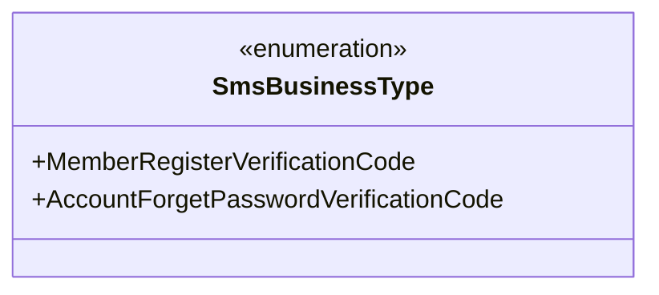
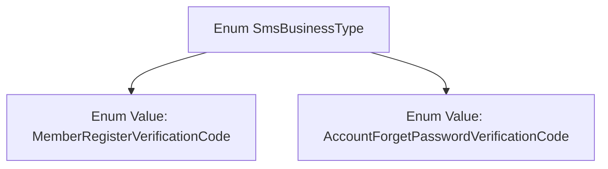

# Basic Information

|      |      |
|------|------|
| Name | SmsBusinessType |
| Language | .java |
| Code Path | WeFe/common/java/common-wefe/src/main/java/com/welab/wefe/common/wefe/enums/SmsBusinessType.java |
| Package Name | com.welab.wefe.common.wefe.enums |
| Dependencies | [] |
| Brief Description | The enumeration SmsBusinessType defines two types of SMS services: member registration verification code and account password recovery verification code. |

# Description

The content defines a public enumeration type named SmsBusinessType, which includes two enumeration values: MemberRegisterVerificationCode and AccountForgetPasswordVerificationCode. These enumeration values represent the business types for member registration verification codes and account password recovery verification codes, respectively, and are used to distinguish between different business scenarios for SMS transmission.

# Class Summary

| Name   | Type  | Description |
|-------|------|-------------|
| SmsBusinessType | enum | The enumeration SmsBusinessType defines two types of SMS services: member registration verification code and account password recovery verification code. |

## Class SmsBusinessType

|      |      |
|------|------|
| Access Modifier | public |
| Type | enum |
| Name | SmsBusinessType |
| Description | The enumeration SmsBusinessType defines two types of SMS services: member registration verification code and account password recovery verification code. |

### UML Class Diagram

This code defines an enumeration type named SmsBusinessType, which includes two enumeration constants: MemberRegisterVerificationCode (member registration verification code) and AccountForgetPasswordVerificationCode (account password recovery verification code). This enumeration is used to represent SMS business types, typically employed to distinguish between different SMS verification scenarios, such as user registration or password reset processes. Enumeration types ensure type safety by restricting input to valid business types, preventing invalid entries.

### Internal Method Call Graph

This flowchart illustrates the structure of the SmsBusinessType enum, which includes two enum values: MemberRegisterVerificationCode (Member Registration Verification Code) and AccountForgetPasswordVerificationCode (Account Password Recovery Verification Code). Enum types are commonly used to define a fixed set of constants. Here, they represent two distinct types of SMS services tailored for different identity verification scenarios.

### Field List

| Name  | Type  | Description |
|-------|-------|------|

### Method List

| Name  | Type  | Description |
|-------|-------|------|

