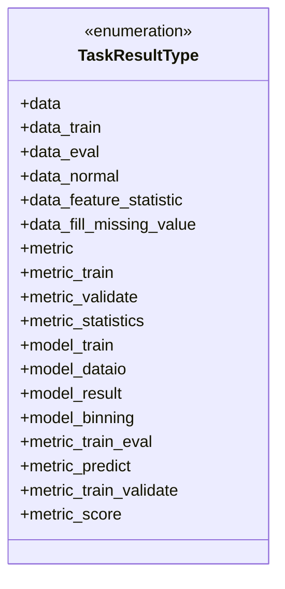

# Basic Information

|      |      |
|------|------|
| Name | TaskResultType |
| Language | .java |
| Code Path | WeFe/common/java/common-wefe/src/main/java/com/welab/wefe/common/wefe/enums/TaskResultType.java |
| Package Name | com.welab.wefe.common.wefe.enums |
| Dependencies | [] |
| Brief Description | Task result type enumeration, including data, model, and metrics categories, covering operation types such as training, evaluation, prediction, and statistics. |

# Description

This enumeration defines the types of task results, encompassing three major categories: data processing, model training, and evaluation metrics. Specific types include raw data, training data, evaluation data, regular data, feature statistics, missing value imputation; training metrics, validation metrics, statistical metrics, scoring metrics; as well as subcategories such as model training, data I/O, result output, and binning processing. It comprehensively covers data outputs and model evaluation stages in the machine learning workflow.

# Class Summary

| Name   | Type  | Description |
|-------|------|-------------|
| TaskResultType | enum | Task result type enumeration, including data, metrics, and model-related types such as training data, evaluation data, feature statistics, missing value imputation, training metrics, validation metrics, statistical metrics, trained models, data IO, binning results, etc. |

## Class TaskResultType

|      |      |
|------|------|
| Access Modifier | public |
| Type | enum |
| Name | TaskResultType |
| Description | Task result type enumeration, including data, metrics, and model-related types such as training data, evaluation data, feature statistics, missing value imputation, training metrics, validation metrics, statistical metrics, trained models, data IO, binning results, etc. |

### UML Class Diagram

This code defines an enumeration type named TaskResultType, containing 17 predefined constant values primarily used to identify different types of task results. These types cover three major categories: data processing (prefix 'data'), model training (prefix 'model'), and evaluation metrics (prefix 'metric'). Each enumeration value represents the output result type of a specific stage in the task pipeline. The enumeration design clearly delineates the three main dimensions of data processing, model training, and evaluation metrics, facilitating the classification and management of different types of intermediate and final results during task execution.

### Internal Method Call Graph

```mermaid
graph TD
    A["Enum TaskResultType"]
    B["Enum value: data"]
    C["Enum value: data_train"]
    D["Enum value: data_eval"]
    E["Enum value: data_normal"]
    F["Enum value: data_feature_statistic"]
    G["Enum value: data_fill_missing_value"]
    H["Enum value: metric"]
    I["Enum value: metric_train"]
    J["Enum value: metric_validate"]
    K["Enum value: metric_statistics"]
    L["Enum value: model_train"]
    M["Enum value: model_dataio"]
    N["Enum value: model_result"]
    O["Enum value: model_binning"]
    P["Enum value: metric_train_eval"]
    Q["Enum value: metric_predict"]
    R["Enum value: metric_train_validate"]
    S["Enum value: metric_score"]

    A --> B
    A --> C
    A --> D
    A --> E
    A --> F
    A --> G
    A --> H
    A --> I
    A --> J
    A --> K
    A --> L
    A --> M
    A --> N
    A --> O
    A --> P
    A --> Q
    A --> R
    A --> S
```

This flowchart illustrates all possible values of the TaskResultType enumeration, comprising a total of 17 enumeration constants, primarily categorized into three types: data processing (prefixed with 'data'), model-related (prefixed with 'model'), and evaluation metrics (prefixed with 'metric'). These enumeration values are used to identify different types of result outputs in machine learning tasks, with each value corresponding to a specific task phase or data processing type, forming a clear hierarchical classification structure.

### Field List

| Name  | Type  | Description |
|-------|-------|------|

### Method List

| Name  | Type  | Description |
|-------|-------|------|

