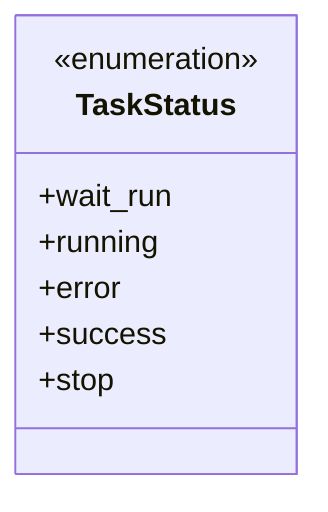
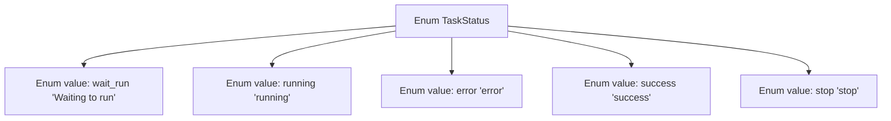

# Basic Information

|      |      |
|------|------|
| Name | TaskStatus |
| Language | .java |
| Code Path | WeFe/common/java/common-wefe/src/main/java/com/welab/wefe/common/wefe/enums/TaskStatus.java |
| Package Name | com.welab.wefe.common.wefe.enums |
| Dependencies | [] |
| Brief Description | Task status enumeration: Waiting to run, Running, Error, Success, Stopped. |

# Description

The enumeration type defines the possible values of task status, including five states: waiting to run, running, error, success, and stopped. Each state has corresponding comments explaining its meaning, clearly describing the different stages or outcomes of a task.

# Class Summary

| Name   | Type  | Description |
|-------|------|-------------|
| TaskStatus | enum | Task status enumeration: Waiting to run, Running, Error, Success, Stopped. |

## Class TaskStatus

|      |      |
|------|------|
| Access Modifier | public |
| Type | enum |
| Name | TaskStatus |
| Description | Task status enumeration: Waiting to run, Running, Error, Success, Stopped. |

### UML Class Diagram

This code defines an enumeration type named TaskStatus, which represents different states of a task. The enumeration includes five constant values: wait_run (waiting to run), running (in progress), error (error), success (success), and stop (stopped). Each enumeration value has corresponding annotations explaining its meaning. Enumeration types are typically used to represent a fixed set of constants that can be used as type-safe options in code. In this example, the TaskStatus enumeration can be used to track and manage the lifecycle states of a task.

### Internal Method Call Graph

This flowchart illustrates the structure of the TaskStatus enumeration, which contains five semantically clear enum values: wait_run indicates a waiting-to-run state, running denotes an in-progress state, error represents an error state, success signifies a successful state, and stop indicates a stopped state. Each enum value is connected to the main enumeration type via arrows, clearly presenting the definition of the enumeration type and all its possible state values.

### Field List

| Name  | Type  | Description |
|-------|-------|------|

### Method List

| Name  | Type  | Description |
|-------|-------|------|

